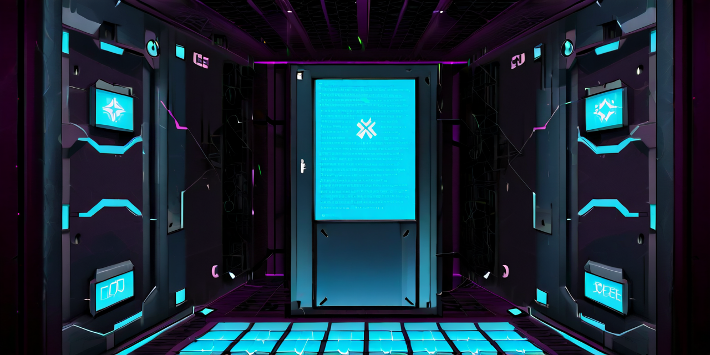

<div align="center">

# OpenClaw Sandbox

### Secure, isolated VM environment for running OpenClaw agents

[](https://github.com/Peleke/openclaw-sandbox/releases)
[](https://github.com/Peleke/openclaw-sandbox/actions/workflows/ci.yml)
[](https://opensource.org/licenses/MIT)
[](https://lima-vm.io/)

**Run AI agents with network containment, audit trails, and secrets management.**



</div>

---

## The Problem

Running AI agents on your host machine is risky:
- Agents can access sensitive files, credentials, and configs
- Network traffic is unrestricted
- No isolation between agent and host processes
- Secrets end up in environment variables, logs, and shell history

**OpenClaw Sandbox** solves this by running agents inside a hardened Linux VM with strict network policies and secure secrets handling.

## Features

- **Network Containment** - UFW firewall with explicit allowlist (only HTTPS, DNS, Tailscale)
- **Secrets Management** - Multiple injection methods, never in logs or process lists
- **Tailscale Integration** - Route to your private network via host
- **Zero-Config Deploy** - Single command bootstrap from macOS
- **Host Mounts** - Bidirectional sync for your codebase and vaults

## Quick Start

```bash
# Clone and run
git clone https://github.com/Peleke/openclaw-sandbox.git
cd openclaw-sandbox

# Bootstrap with your OpenClaw repo and secrets
./bootstrap.sh --openclaw ~/Projects/openclaw --secrets ~/.openclaw-secrets.env

# Access the VM
limactl shell openclaw-sandbox
```

## Architecture

```
┌─────────────────────────────────────────────────────────────────┐
│                         macOS Host                               │
│                                                                  │
│   ┌─────────────┐     ┌─────────────┐     ┌─────────────┐      │
│   │  OpenClaw   │     │   Secrets   │     │  Obsidian   │      │
│   │    Repo     │     │    File     │     │   Vault     │      │
│   └──────┬──────┘     └──────┬──────┘     └──────┬──────┘      │
│          │                   │                   │              │
│          │  Lima mounts      │                   │              │
│          ▼                   ▼                   ▼              │
│   ╔═══════════════════════════════════════════════════════╗    │
│   ║                 Ubuntu 24.04 VM                        ║    │
│   ║  ┌─────────────────────────────────────────────────┐  ║    │
│   ║  │  /mnt/openclaw  /mnt/secrets  /mnt/obsidian     │  ║    │
│   ║  └─────────────────────────────────────────────────┘  ║    │
│   ║                                                        ║    │
│   ║  ┌──────────────┐  ┌──────────────┐  ┌────────────┐  ║    │
│   ║  │   Gateway    │  │   Firewall   │  │  Tailscale │  ║    │
│   ║  │  :18789      │  │     UFW      │  │   Routing  │  ║    │
│   ║  └──────────────┘  └──────────────┘  └────────────┘  ║    │
│   ║                                                        ║    │
│   ║  ┌─────────────────────────────────────────────────┐  ║    │
│   ║  │         /etc/openclaw/secrets.env               │  ║    │
│   ║  │         (mode 0600, service user only)          │  ║    │
│   ║  └─────────────────────────────────────────────────┘  ║    │
│   ╚═══════════════════════════════════════════════════════╝    │
│                              │                                   │
│                              ▼                                   │
│                      localhost:18789                             │
│                    (Gateway API access)                          │
└─────────────────────────────────────────────────────────────────┘
```

## Secrets Management

Three ways to provide secrets, in priority order:

### 1. Direct Injection (CI/CD, testing)

```bash
./bootstrap.sh --openclaw ../openclaw \
  -e "secrets_anthropic_api_key=sk-ant-xxx" \
  -e "secrets_gateway_password=mypass"
```

### 2. Secrets File (recommended for dev)

```bash
# Create secrets file
cat > ~/.openclaw-secrets.env << 'EOF'
ANTHROPIC_API_KEY=sk-ant-xxx
OPENAI_API_KEY=sk-xxx
OPENCLAW_GATEWAY_PASSWORD=mypass
EOF

# Bootstrap with secrets
./bootstrap.sh --openclaw ../openclaw --secrets ~/.openclaw-secrets.env
```

### 3. Config Mount (full OpenClaw config)

```bash
./bootstrap.sh --openclaw ../openclaw --config ~/.openclaw
```

### Supported Secrets

| Variable | Description |
|----------|-------------|
| `ANTHROPIC_API_KEY` | Claude API key |
| `OPENAI_API_KEY` | OpenAI API key |
| `GEMINI_API_KEY` | Google Gemini API key |
| `OPENROUTER_API_KEY` | OpenRouter API key |
| `OPENCLAW_GATEWAY_PASSWORD` | Gateway auth password |
| `OPENCLAW_GATEWAY_TOKEN` | Gateway auth token |
| `SLACK_BOT_TOKEN` | Slack integration |
| `DISCORD_BOT_TOKEN` | Discord integration |
| `TELEGRAM_BOT_TOKEN` | Telegram integration |

## Usage

```bash
# Full bootstrap (creates VM if needed)
./bootstrap.sh --openclaw ~/Projects/openclaw

# With secrets
./bootstrap.sh --openclaw ~/Projects/openclaw --secrets ~/.secrets.env

# With Obsidian vault
./bootstrap.sh --openclaw ~/Projects/openclaw --vault ~/Documents/Vaults/main

# Open VM shell
./bootstrap.sh --shell

# Run interactive onboard
./bootstrap.sh --onboard

# Stop VM
./bootstrap.sh --kill

# Delete VM completely
./bootstrap.sh --delete
```

## Telegram Integration

The sandbox supports Telegram bot integration for ambient agent access:

```bash
# Add your bot token to secrets
echo 'TELEGRAM_BOT_TOKEN=your-bot-token' >> ~/.openclaw-secrets.env

# Re-provision to apply
./bootstrap.sh --openclaw ~/Projects/openclaw --secrets ~/.openclaw-secrets.env
```

The provisioning automatically:
- Sets `dmPolicy: "open"` with `allowFrom: ["*"]` (anyone can message)
- Fixes workspace paths for Linux VM
- Starts the gateway with Telegram long-polling enabled

### Testing Telegram

```bash
# Check gateway status
limactl shell openclaw-sandbox -- systemctl status openclaw-gateway

# View Telegram activity
limactl shell openclaw-sandbox -- tail -f /tmp/openclaw/openclaw-$(date +%Y-%m-%d).log | grep telegram

# Check bot connection
limactl shell openclaw-sandbox -- claw status
```

## Cadence Integration

Cadence is the ambient AI pipeline that watches your Obsidian vault and delivers insights to Telegram:

```
┌──────────────┐     ┌─────────────────┐     ┌──────────────┐     ┌──────────────┐
│   Obsidian   │────▶│  Insight        │────▶│  Insight     │────▶│  Telegram    │
│   Watcher    │     │  Extractor      │     │  Digest      │     │  Delivery    │
│              │     │  (LLM)          │     │  (Batching)  │     │              │
└──────────────┘     └─────────────────┘     └──────────────┘     └──────────────┘
```

### Setup

```bash
# Bootstrap with vault mounted
./bootstrap.sh --openclaw ~/Projects/openclaw --vault ~/Documents/Vaults/main --secrets ~/.secrets.env

# Configure cadence
limactl shell openclaw-sandbox -- nano ~/.openclaw/cadence.json
```

Edit `cadence.json`:
```json
{
  "enabled": true,
  "vaultPath": "/mnt/obsidian",
  "delivery": {
    "channel": "telegram",
    "telegramChatId": "YOUR_CHAT_ID"
  },
  "schedule": {
    "enabled": true,
    "nightlyDigest": "21:00",
    "morningStandup": "08:00"
  }
}
```

### Usage

```bash
# Start cadence service
limactl shell openclaw-sandbox -- sudo systemctl start openclaw-cadence

# Check status
limactl shell openclaw-sandbox -- sudo systemctl status openclaw-cadence

# View logs
limactl shell openclaw-sandbox -- sudo journalctl -u openclaw-cadence -f

# Manual digest trigger
limactl shell openclaw-sandbox -- bun /mnt/openclaw/scripts/cadence.ts digest
```

Write journal entries with `::publish` on line 2 (after the title) to mark them for insight extraction.

### Host CLI Setup

To use `claw` commands from your Mac to the sandboxed gateway:

```bash
# Add to your shell profile (~/.zshrc)
# Detects sandbox and routes to localhost
source ~/.openclaw/dotfiles/env.sh

# Then from host:
claw status  # Shows sandbox gateway status
claw tui     # Opens TUI connected to sandbox
```

## Network Policy

The VM firewall allows only:

| Direction | Port | Protocol | Purpose |
|-----------|------|----------|---------|
| **IN** | 18789 | TCP | Gateway API |
| **IN** | 22 | TCP | SSH/Ansible |
| **OUT** | 443 | TCP | HTTPS (LLM APIs) |
| **OUT** | 80 | TCP | HTTP (apt updates) |
| **OUT** | 53 | UDP/TCP | DNS |
| **OUT** | 100.64.0.0/10 | * | Tailscale |
| **OUT** | 41641 | UDP | Tailscale direct |
| **OUT** | 123 | UDP | NTP |

All other traffic is **denied and logged**.

## Requirements

- macOS with Apple Silicon or Intel
- [Homebrew](https://brew.sh/)
- ~10GB disk space

Dependencies are installed automatically:
- [Lima](https://lima-vm.io/) - Linux VM manager
- [Ansible](https://www.ansible.com/) - Configuration management
- [jq](https://jqlang.github.io/jq/) - JSON processor
- [Tailscale](https://tailscale.com/) - (optional) private networking

## Development Phases

| Phase | Status | Description |
|-------|--------|-------------|
| S1 | Done | Lima VM bootstrap |
| S2 | Done | Gateway deployment |
| S3 | Done | Network containment (UFW) |
| S4 | Done | Tailscale routing |
| S5 | Done | Secrets management |
| S6 | Done | Telegram integration |
| **S7** | **Done** | **Cadence (ambient signals)** |
| S8 | Planned | Audit logging |
| S9 | Planned | Multi-tenant |

## Security Considerations

1. **Secrets never logged** - All Ansible tasks use `no_log: true`
2. **File permissions** - `/etc/openclaw/secrets.env` is `0600`
3. **No process exposure** - Using `EnvironmentFile=` not `Environment=`
4. **Network isolation** - Explicit allowlist, all else denied
5. **No external deps** - No 1Password, no SOPS, just files

## Troubleshooting

### Check VM status
```bash
limactl list
```

### View gateway logs
```bash
limactl shell openclaw-sandbox -- sudo journalctl -u openclaw-gateway -f
```

### Check firewall rules
```bash
limactl shell openclaw-sandbox -- sudo ufw status verbose
```

### Verify secrets loaded
```bash
limactl shell openclaw-sandbox -- sudo cat /etc/openclaw/secrets.env
```

### Test Tailscale routing
```bash
limactl shell openclaw-sandbox -- ~/test-tailscale.sh 100.x.x.x
```

## Tests

The project includes a comprehensive test suite:

```bash
# Run all tests (requires VM running)
./tests/cadence/run-all.sh

# Quick mode - skip E2E tests (no VM required)
./tests/cadence/run-all.sh --quick

# Individual test suites
./tests/cadence/test-cadence-ansible.sh  # Ansible role validation (32 checks)
./tests/cadence/test-cadence-role.sh     # VM deployment tests (22 checks)
./tests/cadence/test-cadence-e2e.sh      # Full pipeline E2E (10 checks)
```

### CI/CD

- **CI** runs on every PR: YAML lint, Ansible validation, ShellCheck
- **Release** workflow triggers on `v*` tags and creates GitHub releases

## Contributing

1. Fork the repo
2. Create a feature branch
3. Make changes
4. Run tests: `./tests/cadence/run-all.sh --quick`
5. Open a PR (CI will run automatically)

## Releases

We use [semantic versioning](https://semver.org/) with milestone-based releases.

### Creating a Release

```bash
# Use the release script
./scripts/release.sh 0.4.0

# This will:
# 1. Validate semver format
# 2. Check you're on main with clean working directory
# 3. Verify/prompt for CHANGELOG entry
# 4. Create tag and push
# 5. GitHub Actions creates the release
```

### Version History

See [CHANGELOG.md](./CHANGELOG.md) for detailed release notes.

## License

MIT License. See [LICENSE](./LICENSE).
