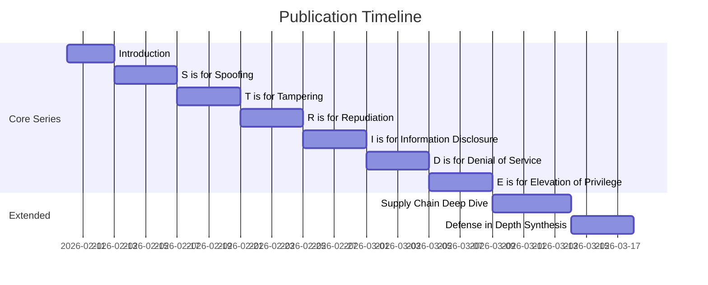

# Publication Series: Threat Modeling with OpenClaw

**Working Title**: "Threat Modeling with OpenClaw (Because, Gawd)"
**Target Audience**: Security engineers, DevOps, AI practitioners
**Format**: Technical blog series (8-10 articles)
**Status**: Planning

---

## Series Overview

This publication series uses the OpenClaw Sandbox as a case study to teach practical threat modeling for AI agent systems. Each article focuses on one aspect of the STRIDE framework, adapted for the unique challenges of autonomous AI.

### Why This Series?

1. **AI agents are different** - Traditional security models don't capture prompt injection, cost amplification, or capability escalation
2. **Real-world example** - Not theoretical; based on actual production security decisions
3. **Actionable** - Each article includes concrete fixes, not just theory
4. **Open source** - Readers can examine the actual code and mitigations

---

## Article Schedule

---

## Article 0: Introduction

**Title**: "Why Your AI Agent Needs a Threat Model"
**Word Count**: 2,000-2,500

### Outline

1. **The Problem with AI Agents**
   - More autonomous than traditional software
   - Access to sensitive resources (APIs, files, networks)
   - Novel attack vectors (prompt injection, cost amplification)

2. **What is Threat Modeling?**
   - Structured approach to identifying security risks
   - Proactive vs reactive security
   - The STRIDE framework

3. **Why STRIDE for AI?**
   - Comprehensive coverage of threat categories
   - Extensible for AI-specific concerns
   - Battle-tested by industry

4. **Introducing the Case Study: OpenClaw Sandbox**
   - What it is (Lima VM, Ansible, UFW)
   - Architecture overview
   - Why it exists (the problem it solves)

5. **Series Roadmap**
   - What each article will cover
   - How to follow along

### Key Diagrams
- Architecture diagram of OpenClaw Sandbox
- Trust boundary visualization
- STRIDE wheel with AI extensions

---

## Article 1: S is for Spoofing

**Title**: "S is for Spoofing: Identity in AI Agent Systems"
**Word Count**: 3,000-3,500
**GitHub Issue**: #TBD

### Outline

1. **What is Spoofing?**
   - Impersonating another user, system, or entity
   - Authentication vs Authorization (spoofing is about authentication)

2. **Spoofing in Traditional Systems**
   - Session hijacking
   - Credential theft
   - IP spoofing

3. **Spoofing in AI Agent Systems**
   - **User identity**: Who is messaging the bot?
   - **Agent identity**: Which agent made this API call?
   - **Request origin**: Is this request from a trusted source?

4. **Case Study: Telegram Bot Open Access**
   - The vulnerability: `dmPolicy: "open"` with `allowFrom: ["*"]`
   - Attack scenario: Anyone discovers bot, exhausts credits
   - The 5 pairing bugs that made authentication fail silently

5. **Mitigations**
   - `dmPolicy: "pairing"` by default
   - Explicit allowlist
   - Self-service pairing with secrets
   - User ID verification

6. **Implementation**
   - Ansible variable changes
   - Bootstrap.sh guards
   - Test cases

7. **Lessons Learned**
   - Default to deny
   - Silent failures are security bugs
   - Authentication must be verifiable

### Key Diagrams
- Telegram authentication flow (before/after)
- Attack tree for identity spoofing
- Pairing flow with bug locations marked

---

## Article 2: T is for Tampering

**Title**: "T is for Tampering: Data Integrity in LLM Pipelines"
**Word Count**: 3,500-4,000
**GitHub Issue**: #TBD

### Outline

1. **What is Tampering?**
   - Unauthorized modification of data
   - In transit vs at rest
   - The integrity property

2. **Traditional Tampering Attacks**
   - MITM attacks
   - SQL injection
   - File modification

3. **Tampering in AI Systems: Prompt Injection**
   - Direct prompt injection (user input)
   - Indirect prompt injection (via retrieved content)
   - Why this is the #1 LLM security risk

4. **Case Study: Cadence Pipeline**
   - Journal entry → Insight extraction → Telegram
   - Injection points: file content, LLM output, delivery
   - Scenario: Malicious note exfiltrates secrets

5. **Other Tampering Vectors**
   - Configuration file modification
   - Mount point manipulation
   - Response modification

6. **Mitigations**
   - Input sanitization (limited effectiveness)
   - Output validation
   - Sandboxing (our approach)
   - Principle of least privilege for agents

7. **Implementation**
   - File integrity monitoring
   - Config file permissions
   - Prompt structure for injection resistance

8. **Lessons Learned**
   - Prompt injection may never be "solved"
   - Defense in depth is essential
   - Limit blast radius

### Key Diagrams
- Prompt injection attack flow
- Cadence pipeline with injection points
- Mitigation layer diagram

---

## Article 3: R is for Repudiation

**Title**: "R is for Repudiation: Audit Trails for Autonomous Agents"
**Word Count**: 2,500-3,000
**GitHub Issue**: #TBD

### Outline

1. **What is Repudiation?**
   - Denying responsibility for actions
   - The non-repudiation property
   - Why audit trails matter

2. **Repudiation in Traditional Systems**
   - Missing logs
   - Log tampering
   - Anonymous actions

3. **Repudiation in AI Systems**
   - "The agent did it" defense
   - Missing attribution in LLM calls
   - Cost tracking per user

4. **Case Study: Who Sent That Message?**
   - Telegram message → Agent action → API cost
   - Current logging gaps
   - Missing cost attribution

5. **Audit Requirements**
   - Who initiated the action?
   - What action was taken?
   - When did it happen?
   - What was the outcome?
   - How much did it cost?

6. **Mitigations**
   - Structured audit logging
   - Tamper-evident logs
   - Cost tracking per user
   - Request correlation IDs

7. **Implementation: Phase S8 Design**
   - Audit log schema
   - Systemd journal integration
   - Cost aggregation

8. **Lessons Learned**
   - Log security-relevant events
   - Make logs tamper-evident
   - Attribute costs to users

### Key Diagrams
- Audit event flow
- Log schema diagram
- Cost attribution flow

---

## Article 4: I is for Information Disclosure

**Title**: "I is for Information Disclosure: Secrets Management for AI Agents"
**Word Count**: 3,000-3,500
**GitHub Issue**: #TBD

### Outline

1. **What is Information Disclosure?**
   - Unauthorized access to confidential data
   - The confidentiality property
   - Types: secrets, PII, intellectual property

2. **Common Disclosure Vectors**
   - Logs
   - Error messages
   - Environment variables
   - Process lists

3. **AI-Specific Disclosure Risks**
   - Context leakage (LLM training data)
   - Prompt echoing
   - Tool output exposure

4. **Case Study: API Key Protection**
   - The journey of a secret: file → mount → env → process
   - Each stage as a leak opportunity
   - How we protect at each layer

5. **Mitigation Stack**
   - `no_log: true` in Ansible
   - File permissions (mode 0600)
   - `EnvironmentFile=` vs `Environment=`
   - UFW egress filtering

6. **Implementation Details**
   - Secrets parsing in Ansible
   - Systemd integration
   - Log redaction

7. **Lessons Learned**
   - Secrets appear in unexpected places
   - Defense in depth for secrets
   - Rotation limits exposure window

### Key Diagrams
- Secret lifecycle diagram
- Leak point visualization
- Mitigation layer stack

---

## Article 5: D is for Denial of Service

**Title**: "D is for Denial of Service: Cost Control for LLM-Powered Systems"
**Word Count**: 3,500-4,000
**GitHub Issue**: #TBD

### Outline

1. **What is Denial of Service?**
   - Making a system unavailable
   - Resource exhaustion
   - The availability property

2. **Traditional DoS**
   - Network flooding
   - CPU exhaustion
   - Storage exhaustion

3. **DoS in AI Systems: Cost Amplification**
   - Every message costs money
   - Attackers don't need botnets, just persistence
   - The economics of LLM abuse

4. **Case Study: Telegram Message Flooding**
   - Open access + no rate limiting = disaster
   - Attack scenario: 1000 messages × $0.01 = $10/minute
   - The pairing limit bug (50 requests then... what?)

5. **Attack Vectors**
   - Message flooding
   - Long prompt attacks
   - Concurrent request exhaustion
   - File watcher spam (Cadence)

6. **Mitigation Stack**
   - Per-user rate limiting
   - Cost budgets
   - Message length limits
   - Request deduplication

7. **Implementation**
   - Rate limiter architecture
   - Budget enforcement
   - Alerting on abuse

8. **Lessons Learned**
   - Every input is a potential DoS vector
   - Cost is a security concern
   - Rate limiting is table stakes

### Key Diagrams
- Cost amplification attack tree
- Rate limiter architecture
- Budget enforcement flow

---

## Article 6: E is for Elevation of Privilege

**Title**: "E is for Elevation: Containing Autonomous AI Agents"
**Word Count**: 3,500-4,000
**GitHub Issue**: #TBD

### Outline

1. **What is Elevation of Privilege?**
   - Gaining unauthorized access
   - Vertical vs horizontal escalation
   - The authorization property

2. **Traditional Elevation**
   - Privilege escalation exploits
   - Container escapes
   - Sudo abuse

3. **Elevation in AI Systems**
   - Agent capability escalation
   - Tool access expansion
   - VM/container escape

4. **Case Study: Supply Chain Escape**
   - Malicious npm package → code execution
   - Code execution → secrets access
   - Secrets access → lateral movement

5. **Containment Strategy**
   - VM isolation (Lima)
   - Network containment (UFW)
   - Non-root service user
   - Explicit mount points

6. **Supply Chain Hardening**
   - Lockfile pinning
   - Checksum verification
   - Dependency scanning
   - SBOM generation

7. **Implementation**
   - Lima security configuration
   - UFW rules deep dive
   - CI/CD security checks

8. **Lessons Learned**
   - Assume breach, limit blast radius
   - Supply chain is the biggest gap
   - Defense in depth is essential

### Key Diagrams
- Containment layer diagram
- Supply chain attack tree
- Privilege boundary visualization

---

## Article 7: Supply Chain Deep Dive

**Title**: "Supply Chain Security for AI Agents: Trust No One"
**Word Count**: 4,000-4,500
**GitHub Issue**: #TBD

### Outline

1. **The Supply Chain Problem**
   - Modern software is built on dependencies
   - Each dependency is a trust decision
   - One compromised package affects millions

2. **Recent Supply Chain Attacks**
   - Event-stream (2018)
   - ua-parser-js (2021)
   - node-ipc (2022)
   - Research on 2025-2026 incidents

3. **OpenClaw Dependency Analysis**
   - Bun runtime
   - npm packages
   - Ubuntu packages
   - OpenClaw itself

4. **Attack Scenarios**
   - Typosquatting
   - Maintainer account compromise
   - Malicious postinstall scripts
   - Dependency confusion

5. **Current Mitigations**
   - VM isolation (limits blast radius)
   - UFW (limits exfiltration)
   - Lockfiles (pins versions)

6. **Gaps and Solutions**
   - SBOM generation
   - Dependency scanning in CI
   - Reproducible builds
   - Vendoring critical deps

7. **Implementation Roadmap**
   - npm audit integration
   - Bun checksum verification
   - Snyk/Dependabot setup
   - SBOM workflow

8. **Lessons Learned**
   - Trust nothing by default
   - Pin everything
   - Monitor for compromises
   - Have an incident response plan

### Key Diagrams
- Dependency graph
- Attack scenario flowcharts
- CI/CD security pipeline

---

## Article 8: Defense in Depth Synthesis

**Title**: "Defense in Depth for AI Agents: Putting It All Together"
**Word Count**: 3,000-3,500

### Outline

1. **Recap: The STRIDE Journey**
   - What we learned in each article
   - Key threats identified
   - Mitigations implemented

2. **Defense in Depth Model**
   - Layer 1: Network
   - Layer 2: Platform
   - Layer 3: Application
   - Layer 4: Data
   - Layer 5: Monitoring

3. **Residual Risks**
   - What we can't fully mitigate
   - Accepting risk vs transferring risk
   - Continuous improvement

4. **Security Operations**
   - Monitoring and alerting
   - Incident response
   - Post-incident review

5. **Future Considerations**
   - Multi-tenant isolation
   - Hardware security modules
   - Confidential computing

6. **Call to Action**
   - Open source the threat model
   - Community contributions
   - Security research opportunities

### Key Diagrams
- Complete defense in depth visualization
- Risk heatmap (before/after)
- Security roadmap

---

## Cross-Article Elements

### Recurring Features

1. **"Try It Yourself" Boxes**
   - Hands-on exercises for each threat category
   - Use the actual OpenClaw Sandbox code

2. **Mermaid Diagrams**
   - Consistent visual style
   - Attack trees for each threat
   - Architecture diagrams

3. **Code Snippets**
   - Real code from the repository
   - Before/after comparisons
   - Test cases

4. **Risk Score Updates**
   - Track risk scores across articles
   - Show reduction from mitigations

### Consistent Terminology

| Term | Definition | First Used |
|------|------------|------------|
| Trust Boundary | Interface between trust levels | Article 0 |
| Attack Tree | Hierarchical attack visualization | Article 0 |
| Blast Radius | Scope of damage | Article 1 |
| Cost Amplification | Financial DoS | Article 5 |
| Capability Escalation | Agent gaining tools | Article 6 |

---

## Distribution Strategy

### Primary Channels
1. **Dev.to** - Technical developer audience
2. **Medium (Towards AI)** - AI practitioner audience
3. **Company Blog** - SEO and ownership
4. **LinkedIn** - Professional network

### Secondary Channels
1. **Hacker News** - Introduction article
2. **Reddit (r/netsec, r/MachineLearning)** - Select articles
3. **Twitter/X Threads** - Summaries

### Repurposing
1. **Conference Talk** - 30-min version of full series
2. **Workshop** - Hands-on threat modeling session
3. **Podcast Appearances** - Discuss key findings

---

## Success Metrics

| Metric | Target | Measurement |
|--------|--------|-------------|
| Total Reads | 10,000+ | Platform analytics |
| GitHub Stars | +100 | GitHub |
| Issues Filed | 5+ | Community engagement |
| Citations | 3+ | Academic/blog references |
| Backlinks | 10+ | SEO tools |

---

## Editorial Standards

1. **Technical Accuracy**
   - All claims backed by code or documentation
   - External claims cited with sources

2. **Reproducibility**
   - All examples runnable with public repo
   - Version-pinned dependencies

3. **Accessibility**
   - Define jargon on first use
   - Progressive complexity (simple → advanced)

4. **Visual Consistency**
   - Mermaid for all diagrams
   - Consistent color scheme
   - Code blocks with syntax highlighting

---

## Timeline Summary

| Week | Activity |
|------|----------|
| Week 1 | Finalize plans, create GitHub issues |
| Week 2 | Article 0 (Introduction) |
| Week 3 | Article 1 (Spoofing) + implement fixes |
| Week 4 | Article 2 (Tampering) |
| Week 5 | Article 3 (Repudiation) + Phase S8 |
| Week 6 | Article 4 (Information Disclosure) |
| Week 7 | Article 5 (Denial of Service) + rate limiting |
| Week 8 | Article 6 (Elevation of Privilege) |
| Week 9 | Article 7 (Supply Chain) |
| Week 10 | Article 8 (Synthesis) + conference proposal |

