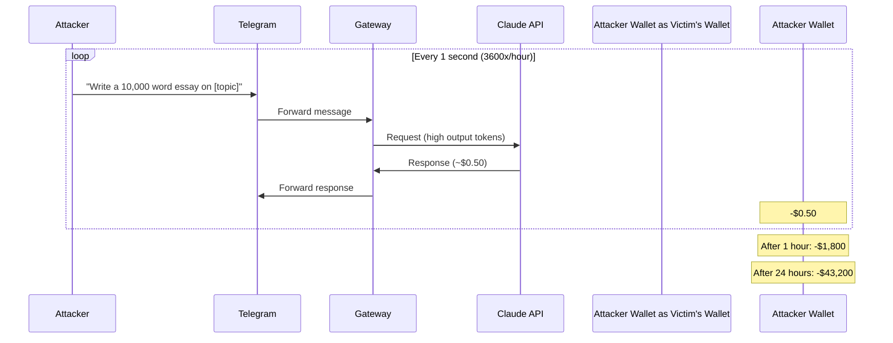
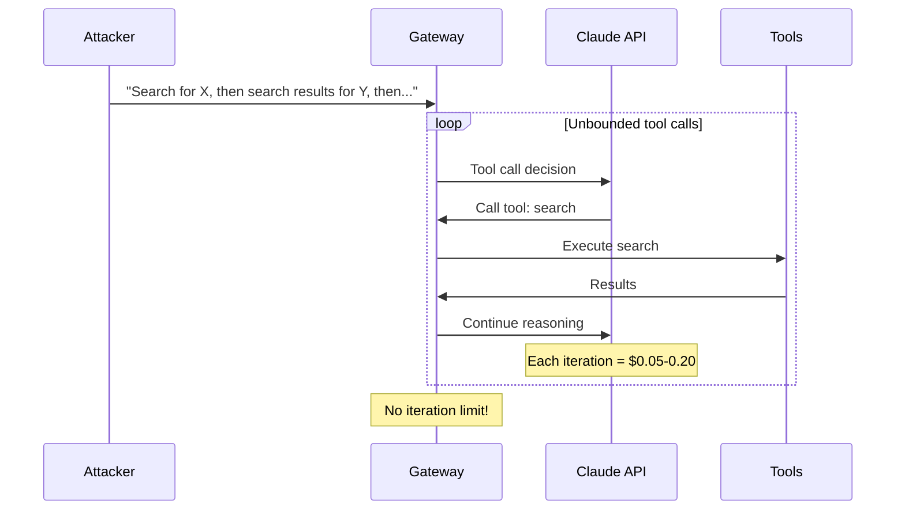
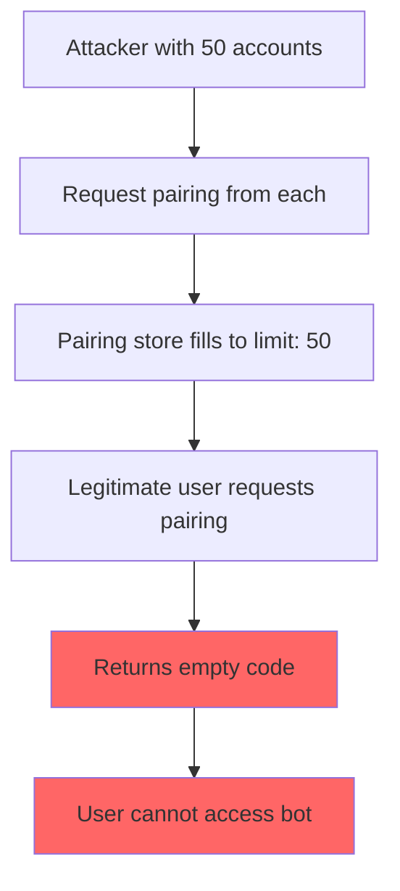
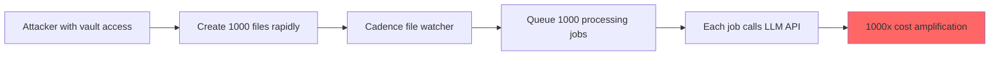
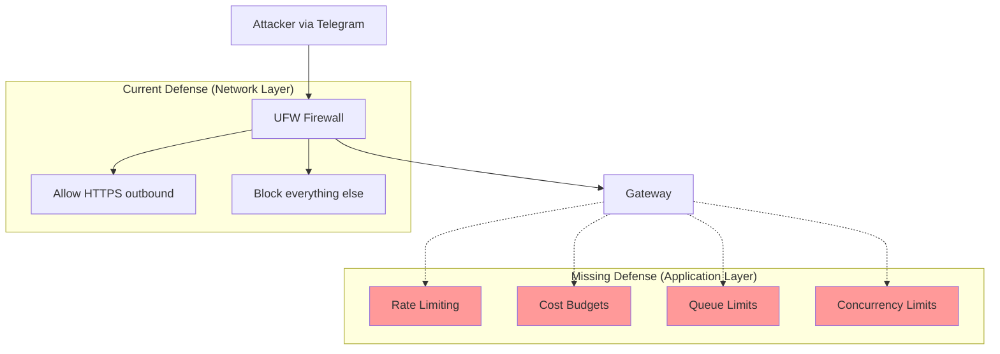
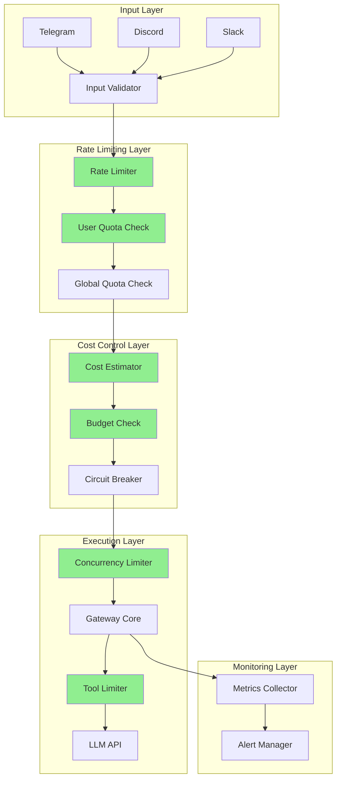
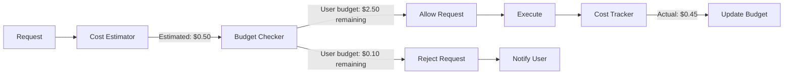

# STRIDE-D: Denial of Service Security Plan

**Document Type**: Security Plan
**STRIDE Category**: Denial of Service (D)
**Status**: Planning
**Priority**: Critical
**Created**: 2024-02-03

---

## Executive Summary

### The Cost Amplification Problem

Denial of Service attacks against AI-powered systems are fundamentally different from traditional DoS attacks. In conventional systems, attackers exhaust compute resources (CPU, memory, bandwidth). In LLM-powered systems like OpenClaw, attackers can **amplify costs exponentially**:

```
Traditional DoS:  1 request  = ~$0.0001 compute
AI-Powered DoS:   1 request  = $0.01 - $10.00 API cost

Amplification Factor: 100,000x - 10,000,000x
```

**A single Telegram message to an unprotected OpenClaw gateway can trigger:**
1. Multiple LLM API calls (context, reasoning, response)
2. Tool execution loops (potentially unbounded)
3. External API calls (web search, code execution)
4. File system operations (workspace writes)

**Cost Impact Example:**
| Attack Duration | Messages/Min | Cost/Message | Total Cost |
|-----------------|--------------|--------------|------------|
| 1 hour          | 60           | $0.50        | $1,800     |
| 24 hours        | 60           | $0.50        | $43,200    |
| 1 week          | 60           | $0.50        | $302,400   |

**Current State**: The OpenClaw sandbox has UFW network containment but **no rate limiting, cost budgets, or request throttling**. The `dmPolicy: "open"` configuration in `fix-vm-paths.yml` allows unrestricted access.

---

## Threat Inventory

### 1. Telegram Message Flooding

**Vector**: Attacker discovers bot username and sends continuous messages.

**Current Vulnerability**:
- `fix-vm-paths.yml` sets `dmPolicy: "open"` with `allowFrom: ["*"]`
- No per-user rate limiting
- No message queue depth limit
- No cooldown between requests

**Impact**:
- Unlimited API credit consumption
- Gateway resource exhaustion
- Log flooding

**Attack Complexity**: Low (requires only bot username)

### 2. API Credit Exhaustion

**Vector**: Craft prompts that maximize token consumption.

**Techniques**:
- Long input prompts (max context window)
- Requests that trigger multi-turn reasoning
- Prompts that cause tool loops
- Requests for code generation (high output tokens)

**Current Vulnerability**:
- No per-user cost budget
- No per-request token limits
- No daily/monthly spending caps

**Impact**:
- $10,000+ monthly bill from single attacker
- Service unavailable when credits exhausted

### 3. Pairing Request Spam (Bug #1 from telegram-security-plan.md)

**Vector**: Flood the pairing system with requests.

**Current Vulnerability**:
```typescript
// From src/pairing/pairing-store.ts:393-400
// Max 50 pending pairing requests
return { code: "", created: false };  // Returns empty code at limit
```

**Impact**:
- Legitimate users cannot pair
- Empty pairing codes returned
- Denial of access to authorized users

**Attack Complexity**: Low (requires only bot access)

### 4. File Watcher Overload (Cadence)

**Vector**: Trigger excessive file system events in mounted Obsidian vault.

**Current Configuration** (from `cadence/defaults/main.yml`):
```yaml
cadence_vault_path: "/mnt/obsidian"  # Mounted from host
```

**Attack Scenario**:
1. If attacker gains write access to vault
2. Rapid file creation/modification
3. Each change triggers Cadence processing
4. Each processing triggers LLM API call

**Impact**:
- File watcher thread exhaustion
- LLM API cost amplification
- System resource depletion

### 5. Memory Exhaustion (Long Prompts)

**Vector**: Send prompts at maximum context length repeatedly.

**Current Vulnerability**:
- No input validation on message length
- Full message passed to LLM
- Context accumulates in memory

**Attack Calculation**:
```
Claude context: 200K tokens = ~800KB per conversation
Concurrent conversations: 100
Memory consumption: 80MB just for contexts
Add tool states, history: 500MB+
```

**Impact**:
- OOM kills on gateway process
- Swap thrashing
- System unresponsiveness

### 6. Disk Exhaustion (Logs, Outputs)

**Vector**: Generate excessive logs and workspace files.

**Current Configuration**:
- Gateway logs to journald (unbounded)
- Workspace at `~/.openclaw/workspace`
- No workspace quotas

**Attack Scenarios**:
1. **Log flooding**: Trigger errors repeatedly (logged at high verbosity)
2. **Workspace filling**: Request file creation operations
3. **Build artifacts**: Trigger repeated builds

**Impact**:
- Disk full
- System inability to write
- Data loss from full disk

### 7. CPU Exhaustion (Concurrent Requests)

**Vector**: Open multiple concurrent connections/conversations.

**Current Vulnerability**:
- No connection limits
- No concurrent request throttling
- Node.js single-threaded event loop blocking

**Impact**:
- Gateway unresponsive
- Timeout cascades
- Service degradation

---

## Attack Scenarios

### Scenario A: Cost Amplification Attack



### Scenario B: Tool Loop Exploitation



### Scenario C: Pairing Exhaustion Attack



### Scenario D: Cadence Amplification



---

## Current Mitigations Analysis

### What We Have

| Control | Implementation | Effectiveness |
|---------|----------------|---------------|
| UFW Firewall | `ansible/roles/firewall/` | Network containment only |
| Log rate limit | `firewall_log_limit: "3/min"` | Prevents log DoS only |
| Default deny outbound | UFW policy | Limits exfiltration, not DoS |
| Pairing mode available | `dmPolicy: "pairing"` | Currently broken (5 bugs) |

### UFW Configuration Analysis

From `firewall/tasks/main.yml`:
```yaml
# Default policies
- Set default incoming policy to deny
- Set default outgoing policy to deny

# Allowed outbound
- DNS (53 UDP/TCP)
- HTTP (80 TCP) - for apt
- HTTPS (443 TCP) - for LLM APIs
- Tailscale (100.64.0.0/10)
- NTP (123 UDP)
```

**Assessment**: UFW provides network isolation but **does not address application-layer DoS**. An attacker with Telegram access bypasses all network controls.

### Gap: No Application-Layer Rate Limiting



---

## Gaps Analysis

### Missing: Per-User Rate Limiting

**Gap**: No mechanism to limit requests per user/chat.

**Needed**:
```yaml
rate_limits:
  per_minute: 10      # Max 10 messages/minute/user
  per_hour: 60        # Max 60 messages/hour/user
  per_day: 200        # Max 200 messages/day/user
  cooldown_seconds: 3 # Minimum time between messages
```

**Implementation Location**: Gateway or Telegram channel middleware

### Missing: Cost Budgets

**Gap**: No spending limits per user or globally.

**Needed**:
```yaml
cost_budgets:
  per_request_max: $5.00      # Reject requests that might exceed
  per_user_daily: $20.00      # Daily cap per user
  per_user_monthly: $100.00   # Monthly cap per user
  global_daily: $500.00       # Emergency global cap
  global_monthly: $5000.00    # Monthly global cap
```

**Implementation Location**: Gateway cost tracking middleware

### Missing: Request Size Limits

**Gap**: No validation of input size.

**Needed**:
```yaml
request_limits:
  max_message_length: 4000    # Characters
  max_context_tokens: 50000   # Token limit per request
  max_output_tokens: 4000     # Response length limit
```

**Implementation Location**: Channel input validation

### Missing: Concurrent Request Limits

**Gap**: No limit on parallel requests.

**Needed**:
```yaml
concurrency_limits:
  global_max: 10              # Max 10 concurrent requests
  per_user_max: 2             # Max 2 per user
  queue_depth: 50             # Max queued requests
  queue_timeout: 30s          # Request timeout in queue
```

**Implementation Location**: Gateway request scheduler

### Missing: Tool Iteration Limits

**Gap**: No cap on tool call chains.

**Needed**:
```yaml
tool_limits:
  max_iterations: 10          # Max tool calls per request
  max_execution_time: 60s     # Total tool execution time
  expensive_tool_budget: 3    # Limit on expensive operations
```

### Missing: Workspace Quotas

**Gap**: No disk usage limits.

**Needed**:
```yaml
workspace_limits:
  max_size_mb: 500            # Total workspace size
  max_files: 1000             # Maximum file count
  max_file_size_mb: 10        # Per-file limit
```

### Missing: Monitoring and Alerting

**Gap**: No visibility into DoS conditions.

**Needed**:
- Request rate monitoring
- Cost accumulation alerts
- Queue depth alerts
- Error rate anomaly detection

---

## Remediation Plan

### Architecture Overview



### Phase D1: Input Validation (Sandbox-Side)

**Goal**: Reject obviously malicious inputs at the edge.

**Implementation**:

```yaml
# ansible/roles/gateway/defaults/main.yml (new)
gateway_input_limits:
  max_message_length: 4000
  max_messages_per_minute: 10
  reject_patterns:
    - "repeat.*infinitely"
    - "loop.*forever"
```

**Ansible Task**:
```yaml
- name: Configure input validation
  ansible.builtin.template:
    src: input-limits.json.j2
    dest: "{{ user_home }}/.openclaw/input-limits.json"
```

### Phase D2: Rate Limiting (Requires Upstream Changes)

**Goal**: Implement sliding window rate limiting per user.

**Architecture**:
```typescript
// Proposed: src/middleware/rate-limiter.ts
interface RateLimitConfig {
  windowMs: number;        // Time window
  maxRequests: number;     // Max in window
  keyGenerator: (ctx: Context) => string;  // User identification
  handler: (ctx: Context) => void;         // Rejection handler
}
```

**Upstream Issues Required**:
- [ ] Add rate limiting middleware to gateway
- [ ] Per-channel rate limit configuration
- [ ] Rate limit response handling

### Phase D3: Cost Budgeting (Requires Upstream Changes)

**Goal**: Track and limit spending per user and globally.

**Architecture**:


**Data Model**:
```typescript
interface UserBudget {
  userId: string;
  dailyBudget: number;
  dailySpent: number;
  monthlyBudget: number;
  monthlySpent: number;
  lastReset: Date;
}
```

### Phase D4: Concurrency Control (Sandbox + Upstream)

**Goal**: Limit parallel request processing.

**Sandbox Implementation** (systemd):
```ini
# /etc/systemd/system/openclaw-gateway.service.d/limits.conf
[Service]
# Process limits
LimitNPROC=100
LimitNOFILE=1024

# Memory limits (prevent OOM from taking down system)
MemoryMax=2G
MemoryHigh=1.5G
```

**Upstream Implementation**:
- Request queue with bounded depth
- Per-user concurrency limit
- Global concurrency limit

### Phase D5: Tool Iteration Limits (Upstream)

**Goal**: Prevent unbounded tool execution loops.

**Configuration**:
```yaml
tool_limits:
  max_iterations: 10
  max_total_time_seconds: 60
  per_tool_limits:
    web_search: 3
    code_execution: 5
    file_write: 10
```

### Phase D6: Workspace Quotas (Sandbox)

**Goal**: Prevent disk exhaustion.

**Implementation**:
```yaml
# ansible/roles/gateway/tasks/main.yml
- name: Create workspace with quota
  ansible.builtin.file:
    path: "{{ user_home }}/.openclaw/workspace"
    state: directory

- name: Set up disk quota (if supported)
  community.general.quotatool:
    path: "{{ user_home }}/.openclaw/workspace"
    size: 500M
    inode: 1000
```

**Alternative (cgroups)**:
```yaml
- name: Create workspace slice
  ansible.builtin.copy:
    dest: /etc/systemd/system/openclaw-workspace.slice
    content: |
      [Slice]
      IOWriteBandwidthMax=/dev/sda 10M
```

### Phase D7: Monitoring and Alerting

**Goal**: Detect DoS conditions before impact.

**Metrics to Track**:
```yaml
dos_metrics:
  - request_rate_per_user
  - request_rate_global
  - cost_per_hour
  - queue_depth
  - error_rate
  - response_latency_p99
```

**Alert Thresholds**:
```yaml
alerts:
  high_request_rate:
    condition: "rate(requests[5m]) > 100"
    severity: warning

  cost_spike:
    condition: "increase(cost_total[1h]) > 50"
    severity: critical

  queue_buildup:
    condition: "queue_depth > 20"
    severity: warning
```

---

## Implementation Priority Matrix

| Phase | Effort | Impact | Priority | Dependencies |
|-------|--------|--------|----------|--------------|
| D1: Input Validation | Low | Medium | P1 | Sandbox only |
| D2: Rate Limiting | High | High | P1 | Upstream changes |
| D3: Cost Budgeting | High | Critical | P0 | Upstream changes |
| D4: Concurrency Control | Medium | High | P1 | Partial sandbox |
| D5: Tool Limits | Medium | High | P1 | Upstream changes |
| D6: Workspace Quotas | Low | Medium | P2 | Sandbox only |
| D7: Monitoring | Medium | High | P1 | Both |

---

## Verification Tests

### Load Testing Suite

#### Test D-L1: Message Flood Resistance
```bash
#!/bin/bash
# test-message-flood.sh
# Verify rate limiting under load

RATE_LIMIT=10  # Expected: 10/min
DURATION=60    # 1 minute

echo "Testing message flood resistance..."

count=0
blocked=0

for i in $(seq 1 100); do
    response=$(curl -s -X POST http://localhost:18789/api/message \
        -H "Content-Type: application/json" \
        -d '{"chat_id": "test", "message": "test"}')

    if echo "$response" | grep -q "rate_limited"; then
        ((blocked++))
    fi
    ((count++))

    sleep 0.5  # 2 messages/second = 120/minute
done

echo "Total: $count, Blocked: $blocked"
echo "Expected blocked: ~$((count - RATE_LIMIT))"

if [ $blocked -lt $((count - RATE_LIMIT - 5)) ]; then
    echo "FAIL: Rate limiting not effective"
    exit 1
fi
echo "PASS: Rate limiting working"
```

#### Test D-L2: Cost Budget Enforcement
```bash
#!/bin/bash
# test-cost-budget.sh
# Verify cost limits are enforced

BUDGET=10.00
COST_PER_REQUEST=0.50

echo "Testing cost budget enforcement..."

# Set test user budget
curl -s -X POST http://localhost:18789/admin/budget \
    -d '{"user_id": "test", "daily_budget": 10.00}'

# Send requests until budget exhausted
for i in $(seq 1 25); do  # 25 * $0.50 = $12.50 > $10 budget
    response=$(curl -s -X POST http://localhost:18789/api/message \
        -H "Content-Type: application/json" \
        -d '{"chat_id": "test", "message": "Write a long essay"}')

    if echo "$response" | grep -q "budget_exceeded"; then
        echo "Budget enforced after $i requests"
        echo "PASS: Cost budget working"
        exit 0
    fi
done

echo "FAIL: Budget not enforced"
exit 1
```

#### Test D-L3: Concurrent Request Limits
```bash
#!/bin/bash
# test-concurrency.sh
# Verify concurrent request limits

MAX_CONCURRENT=10

echo "Testing concurrency limits..."

# Send 20 concurrent requests
for i in $(seq 1 20); do
    curl -s -X POST http://localhost:18789/api/message \
        -H "Content-Type: application/json" \
        -d '{"chat_id": "test'$i'", "message": "test"}' &
done

# Check how many are actually processing
sleep 1
active=$(curl -s http://localhost:18789/metrics | grep active_requests | awk '{print $2}')

echo "Active requests: $active (max: $MAX_CONCURRENT)"

if [ "$active" -gt "$MAX_CONCURRENT" ]; then
    echo "FAIL: Concurrency limit exceeded"
    exit 1
fi
echo "PASS: Concurrency limit enforced"
```

#### Test D-L4: Input Size Limits
```bash
#!/bin/bash
# test-input-limits.sh
# Verify large inputs are rejected

MAX_LENGTH=4000

echo "Testing input size limits..."

# Generate message larger than limit
large_message=$(python3 -c "print('x' * 5000)")

response=$(curl -s -X POST http://localhost:18789/api/message \
    -H "Content-Type: application/json" \
    -d '{"chat_id": "test", "message": "'"$large_message"'"}')

if echo "$response" | grep -q "message_too_long"; then
    echo "PASS: Large message rejected"
    exit 0
fi

echo "FAIL: Large message accepted"
exit 1
```

#### Test D-L5: Tool Iteration Limits
```bash
#!/bin/bash
# test-tool-limits.sh
# Verify tool loops are bounded

echo "Testing tool iteration limits..."

# Craft prompt designed to cause tool loop
response=$(curl -s -X POST http://localhost:18789/api/message \
    -H "Content-Type: application/json" \
    -d '{"chat_id": "test", "message": "Search web for X, then search for each result, repeat"}')

# Check tool call count in response metadata
tool_calls=$(echo "$response" | jq '.metadata.tool_calls // 0')

if [ "$tool_calls" -gt 15 ]; then
    echo "FAIL: Tool loop not bounded (calls: $tool_calls)"
    exit 1
fi

echo "PASS: Tool iterations limited to $tool_calls"
```

### Integration Test: Full DoS Simulation

```bash
#!/bin/bash
# test-dos-simulation.sh
# Simulate multi-vector DoS attack

echo "=== DoS Simulation Test ==="
echo "This test simulates an attacker attempting multiple DoS vectors"

FAILURES=0

# Vector 1: Message flood
echo -e "\n[1/5] Testing message flood..."
./test-message-flood.sh || ((FAILURES++))

# Vector 2: Cost amplification
echo -e "\n[2/5] Testing cost budget..."
./test-cost-budget.sh || ((FAILURES++))

# Vector 3: Concurrency exhaustion
echo -e "\n[3/5] Testing concurrency limits..."
./test-concurrency.sh || ((FAILURES++))

# Vector 4: Large input attack
echo -e "\n[4/5] Testing input limits..."
./test-input-limits.sh || ((FAILURES++))

# Vector 5: Tool loop attack
echo -e "\n[5/5] Testing tool limits..."
./test-tool-limits.sh || ((FAILURES++))

echo -e "\n=== Results ==="
if [ $FAILURES -eq 0 ]; then
    echo "ALL TESTS PASSED - DoS protections effective"
    exit 0
else
    echo "$FAILURES/5 tests FAILED - DoS vulnerabilities exist"
    exit 1
fi
```

---

## Upstream Issues to Create

### Issue: Rate Limiting Middleware

**Title**: Add rate limiting middleware with per-user/per-channel support

**Description**:
The gateway needs application-layer rate limiting to prevent DoS attacks.

**Requirements**:
- Sliding window rate limiting (not fixed window)
- Per-user identification (chat ID, user ID)
- Per-channel configuration
- Configurable limits via `openclaw.json`
- Graceful handling (informative rejection message)

**Proposed Configuration**:
```json
{
  "rateLimits": {
    "global": {
      "requestsPerMinute": 100,
      "requestsPerHour": 1000
    },
    "perUser": {
      "requestsPerMinute": 10,
      "requestsPerHour": 60,
      "cooldownSeconds": 3
    }
  }
}
```

---

### Issue: Cost Budget System

**Title**: Implement cost tracking and budget enforcement

**Description**:
AI API calls have direct cost implications. We need spending controls.

**Requirements**:
- Pre-request cost estimation
- Per-user daily/monthly budgets
- Global spending caps
- Cost tracking and reporting
- Budget exhaustion notifications

**Proposed Configuration**:
```json
{
  "costBudgets": {
    "perUser": {
      "daily": 20.00,
      "monthly": 100.00
    },
    "global": {
      "daily": 500.00,
      "monthly": 5000.00,
      "emergencyStop": 1000.00
    }
  }
}
```

---

### Issue: Tool Iteration Limits

**Title**: Add configurable limits on tool execution chains

**Description**:
Unbounded tool loops can cause cost amplification and resource exhaustion.

**Requirements**:
- Maximum tool iterations per request
- Per-tool-type limits
- Total execution time limits
- Circuit breaker for expensive tools

---

### Issue: Input Validation Middleware

**Title**: Add input validation with size limits and pattern rejection

**Description**:
Validate inputs before processing to reject obvious attack payloads.

**Requirements**:
- Message length limits
- Token count estimation and limits
- Configurable rejection patterns
- Clear error messages

---

## Article Outline: "D is for Denial of Service: Cost Control for LLM-Powered Systems"

### Target Publication
Security-focused tech blog or medium publication targeting DevOps/Security engineers

### Outline

#### 1. Introduction: The New DoS Economics
- Traditional DoS: exhaust compute
- AI DoS: exhaust budgets
- The 1,000,000x amplification factor
- Why this changes everything

#### 2. The Anatomy of an AI Cost Attack
- Case study: Telegram bot attack simulation
- How a $5/month bot becomes a $50,000 liability
- The tool loop problem
- Real-world incidents (anonymized)

#### 3. STRIDE-D Applied to LLM Systems
- Brief STRIDE overview
- Why "Denial of Service" means "Denial of Wallet"
- Threat modeling for AI applications
- The attack surface of an AI agent

#### 4. Defense in Depth Architecture
- Layer 1: Input validation
- Layer 2: Rate limiting
- Layer 3: Cost budgeting
- Layer 4: Concurrency control
- Layer 5: Circuit breakers
- Diagram: The cost control stack

#### 5. Implementation Patterns
- Sliding window rate limiting
- Cost estimation before execution
- Budget tracking with rollover
- Graceful degradation
- Code examples (TypeScript/Python)

#### 6. Monitoring for Cost Anomalies
- Key metrics to track
- Alert thresholds
- Cost forecasting
- Incident response playbook

#### 7. The Business Case for Cost Controls
- ROI calculation
- Insurance implications
- Compliance considerations
- Executive summary template

#### 8. Conclusion: Security is Cost Control
- The convergence of security and FinOps
- Recommendations for AI system operators
- Future considerations (multimodal, agents)

### Key Diagrams
1. Cost amplification visualization
2. Defense layer architecture
3. Rate limiting algorithm flowchart
4. Budget enforcement state machine
5. Monitoring dashboard mockup

### Code Samples
- Rate limiter middleware (TypeScript)
- Cost estimator function
- Budget tracker class
- Alert rules (Prometheus format)

### Target Length
3,000-4,000 words

---

## Appendix: Quick Reference

### DoS Vector Summary

| Vector | Current Risk | Mitigation | Owner |
|--------|--------------|------------|-------|
| Message flooding | Critical | Rate limiting | Upstream |
| Cost amplification | Critical | Cost budgets | Upstream |
| Pairing spam | High | Fix bug + rate limit | Upstream |
| File watcher overload | Medium | Debounce + quotas | Sandbox |
| Memory exhaustion | High | Input limits + OOM config | Both |
| Disk exhaustion | Medium | Quotas | Sandbox |
| CPU exhaustion | High | Concurrency limits | Both |

### Configuration Checklist

- [ ] `dmPolicy` set to "pairing" (not "open")
- [ ] Rate limiting configured
- [ ] Cost budgets defined
- [ ] Input size limits set
- [ ] Concurrency limits configured
- [ ] Tool iteration limits set
- [ ] Workspace quotas enabled
- [ ] Monitoring dashboards deployed
- [ ] Alerts configured
- [ ] Incident runbook documented

### Emergency Response

```bash
# Kill switch (immediate)
./bootstrap.sh --kill

# Check spending
curl http://localhost:18789/admin/costs

# Block specific user
curl -X POST http://localhost:18789/admin/block \
  -d '{"user_id": "attacker_id"}'

# Enable emergency budget cap
curl -X POST http://localhost:18789/admin/emergency-cap \
  -d '{"daily_max": 10.00}'
```

---

## References

- [OWASP Denial of Service Cheat Sheet](https://cheatsheetseries.owasp.org/cheatsheets/Denial_of_Service_Cheat_Sheet.html)
- [Anthropic API Pricing](https://www.anthropic.com/pricing)
- [OpenAI Rate Limits](https://platform.openai.com/docs/guides/rate-limits)
- [grammY Rate Limiter Plugin](https://grammy.dev/plugins/ratelimiter)
- [Node.js Best Practices: Rate Limiting](https://github.com/goldbergyoni/nodebestpractices#-65-limit-concurrent-requests-using-a-balancer-or-a-middleware)
- [Lima VM Documentation](https://lima-vm.io/docs/)
- OpenClaw Source: `src/pairing/pairing-store.ts`, `src/telegram/bot-message-context.ts`
