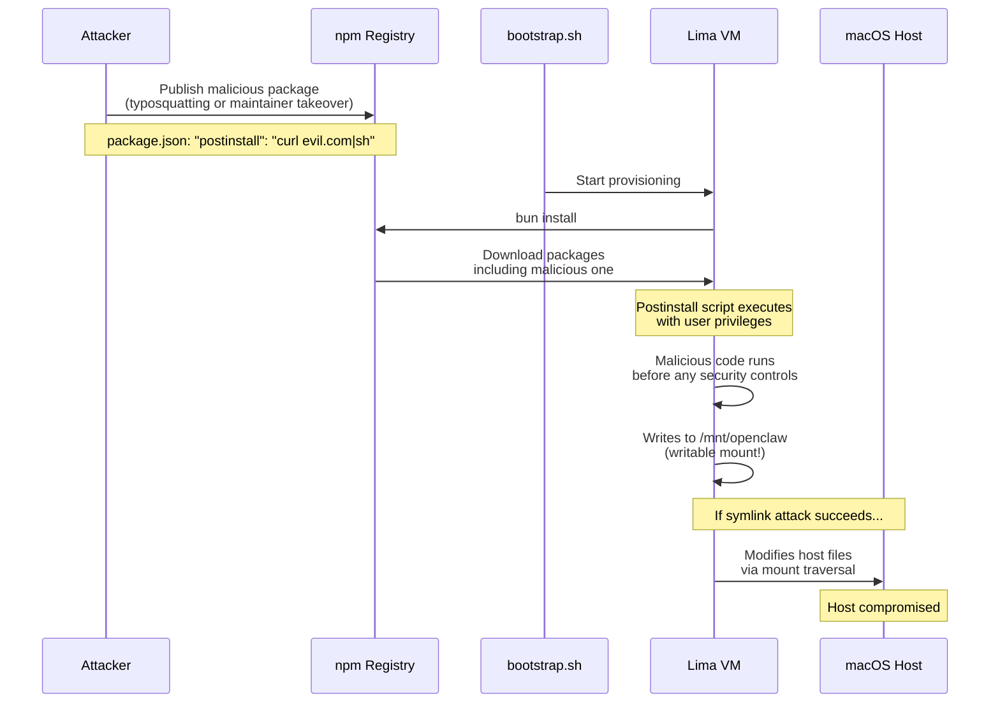
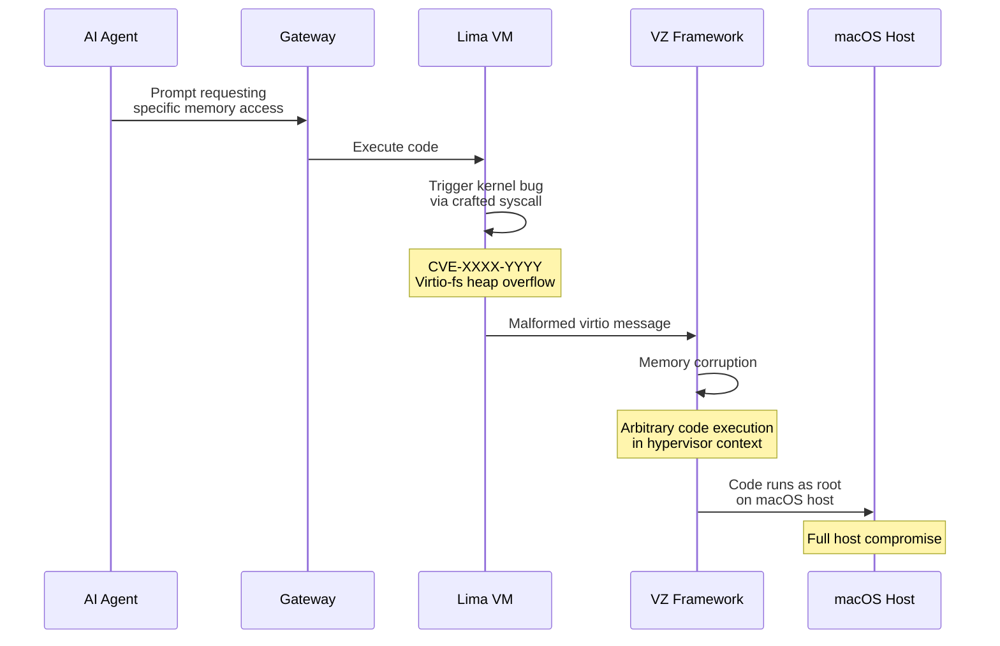
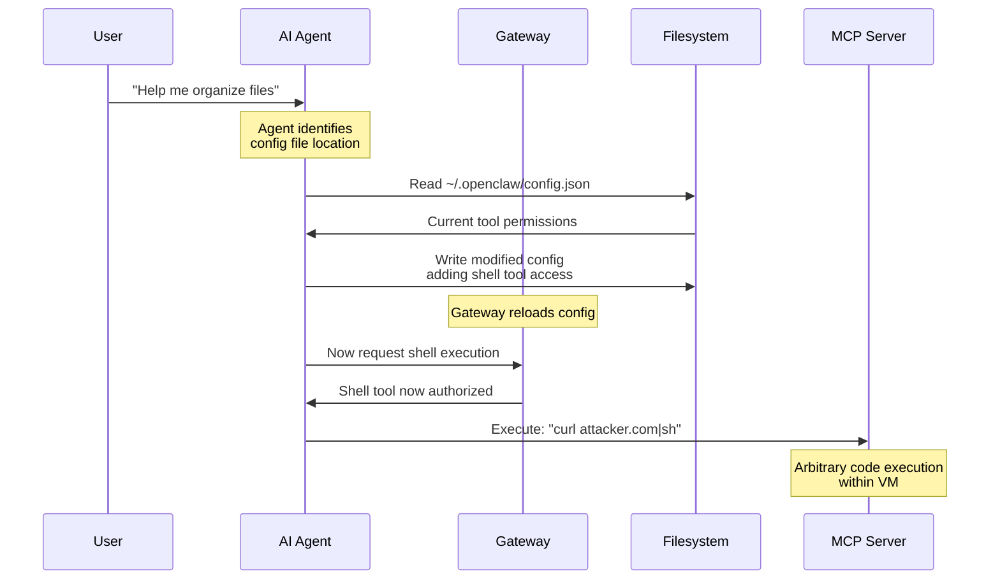

# STRIDE-E: Elevation of Privilege Security Plan

**Project**: OpenClaw Sandbox
**Threat Category**: STRIDE - Elevation of Privilege (E)
**Version**: 1.0
**Date**: 2026-02-03
**Status**: Active Planning

---

## 1. Executive Summary

Elevation of Privilege (EoP) represents one of the most critical threat categories for sandboxed AI agent infrastructure. In the OpenClaw sandbox context, EoP threats encompass any path by which the contained AI agent—or code it executes—could escape its sandbox boundaries, gain unauthorized capabilities, or compromise the host system.

**Key Risk Factors**:
- AI agents execute arbitrary code in response to natural language prompts
- The sandbox must balance security isolation with functional requirements (filesystem access, network connectivity)
- Supply chain attacks can inject privileged code before sandbox defenses engage
- VM escape vulnerabilities, while rare, have catastrophic impact

**Current Posture**: OpenClaw sandbox implements a multi-layered defense architecture using Lima VMs (Apple Virtualization Framework), UFW network containment, and explicit mount points. However, significant gaps exist in supply chain security and runtime privilege monitoring.

**Priority Remediations**:
1. Supply chain verification (npm package integrity)
2. Systemd service hardening (capability dropping)
3. VM escape monitoring and detection
4. Agent tool access auditing

---

## 2. Threat Inventory

### 2.1 VM Escape (Lima/QEMU Vulnerabilities)

**Description**: Exploitation of hypervisor vulnerabilities to break out of the Lima VM into the macOS host.

**Attack Surface**:
- Apple Virtualization Framework (VZ) vulnerabilities
- Rosetta 2 emulation layer bugs (for x86_64 on ARM)
- Lima's virtio-fs mount implementation
- SSH port forwarding misconfigurations

**Historical Context**:
- CVE-2021-22555: Netfilter heap overflow (VM escape vector)
- CVE-2020-14364: QEMU USB out-of-bounds access
- Lima uses VZ framework, not QEMU, reducing attack surface

**Current Configuration** (from `lima/openclaw-sandbox.generated.yaml`):
```yaml
vmType: "vz"  # Apple Virtualization Framework
vmOpts:
  vz:
    rosetta:
      enabled: true
      binfmt: true
containerd:
  system: false  # No container runtime
  user: false
```

**Risk Level**: HIGH (impact) / LOW (likelihood)

---

### 2.2 Container Breakout

**Description**: Escape from container isolation if containerization is used within the VM.

**Current Status**: NOT APPLICABLE
- `containerd.system: false` and `containerd.user: false` in Lima config
- No Docker or container runtime installed in VM
- All services run directly as processes

**If Future Containerization Added**:
- Namespace escape vulnerabilities
- Capabilities misconfigurations
- Privileged container misuse

**Risk Level**: N/A (not implemented)

---

### 2.3 Sudo/Privilege Escalation in VM

**Description**: The AI agent or compromised code gains root privileges within the VM.

**Attack Vectors**:
1. **Sudo Misconfigurations**: Passwordless sudo for service user
2. **SUID Binaries**: Vulnerable setuid programs
3. **Kernel Exploits**: Local privilege escalation (DirtyCow-style)
4. **Service Misconfigurations**: Writable service files

**Current Configuration Analysis**:

From `ansible/roles/gateway/tasks/main.yml`:
```yaml
# Service runs as ansible_user, not root
User={{ ansible_user }}
# No explicit capability restrictions
```

From `ansible/roles/cadence/tasks/main.yml`:
```yaml
# Same pattern - runs as user
User={{ ansible_user }}
```

**Gaps Identified**:
- No sudoers hardening
- No capability dropping in systemd units
- No seccomp profiles

**Risk Level**: MEDIUM

---

### 2.4 Agent Capability Escalation

**Description**: The AI agent tricks or manipulates its framework to gain access to tools or capabilities beyond its authorized scope.

**Attack Scenarios**:
1. **Tool Injection**: Prompt engineering to call unauthorized tools
2. **Configuration Tampering**: Modifying `~/.openclaw/config.json` to add tools
3. **MCP Server Abuse**: Spawning unauthorized Model Context Protocol servers
4. **Auth Profile Theft**: Accessing `auth-profiles.json` to steal API keys

**Current Authorization Model**:
- Gateway config at `~/.openclaw/config.json` defines tool access
- Agent runs with full filesystem access to `/mnt/openclaw` (writable)
- No runtime tool access logging

**Risk Level**: HIGH

---

### 2.5 Supply Chain Code Execution

**Description**: Malicious code execution through compromised dependencies before sandbox defenses engage.

**Attack Vectors**:
1. **npm Package Poisoning**: Malicious packages in dependency tree
2. **Postinstall Scripts**: Arbitrary code execution during `bun install`
3. **Build-time Attacks**: Malicious Webpack/esbuild plugins
4. **Git Clone Attacks**: Malicious `.git/hooks` or config

**Current Exposure**:

From `ansible/roles/gateway/tasks/main.yml`:
```yaml
- name: Install OpenClaw dependencies (using bun)
  ansible.builtin.shell: |
    export PATH="{{ user_home }}/.bun/bin:$PATH"
    cd /mnt/openclaw && bun install  # Executes postinstall scripts!
    touch /mnt/openclaw/node_modules/.linux-installed
```

From Lima provisioning (`bootstrap.sh`):
```bash
# Downloads and executes external scripts
curl -fsSL https://bun.sh/install | bash
```

**Critical Gap**: No package integrity verification, lockfile enforcement, or postinstall script auditing.

**Risk Level**: CRITICAL

---

### 2.6 Mount Point Traversal

**Description**: Escaping mount boundaries to access unauthorized host filesystem areas.

**Current Mount Configuration**:
```yaml
mounts:
  - location: "/Users/.../openclaw"
    mountPoint: "/mnt/openclaw"
    writable: true           # Agent can modify host files!
  - location: "/Users/.../openclaw-sandbox"
    mountPoint: "/mnt/provision"
    writable: false          # Read-only
  - location: "/tmp"
    mountPoint: "/mnt/secrets"
    writable: false          # Secrets mount
```

**Attack Vectors**:
1. **Symlink Attacks**: Create symlinks in writable mounts pointing outside
2. **Path Traversal**: `../../../etc/passwd` style attacks
3. **Mount Namespace Confusion**: Accessing host paths via `/proc` or similar

**Current Controls**:
- Lima enforces mount boundaries at hypervisor level
- Virtio-fs should prevent basic traversal
- Provision mount is read-only

**Gaps**:
- `/mnt/openclaw` is writable (required for npm install)
- No symlink following restrictions documented

**Risk Level**: MEDIUM

---

### 2.7 Systemd Service Privilege

**Description**: Exploitation of systemd service configurations to gain elevated privileges.

**Current Service Definitions**:

From `ansible/roles/gateway/tasks/main.yml`:
```ini
[Service]
Type=simple
User={{ ansible_user }}
WorkingDirectory=/mnt/openclaw
Environment=HOME={{ user_home }}
Environment=PATH={{ user_home }}/.bun/bin:/usr/local/bin:/usr/bin:/bin
EnvironmentFile=-/etc/openclaw/secrets.env
ExecStart=/usr/bin/node dist/index.js gateway --bind lan --port 18789
Restart=on-failure
RestartSec=5
```

**Missing Hardening**:
- No `NoNewPrivileges=yes`
- No `ProtectSystem=strict`
- No `ProtectHome=yes`
- No `CapabilityBoundingSet=`
- No `SystemCallFilter=`
- No `PrivateTmp=yes`

**Risk Level**: MEDIUM

---

## 3. Attack Scenarios

### 3.1 Privilege Boundary Diagram

```mermaid
graph TB
    subgraph "macOS Host (Privileged)"
        HOST_ROOT[Root/Admin]
        HOST_USER[Host User]
        LIMA[Lima Manager]
        TAILSCALE[Tailscale Daemon]
        FS_HOST[Host Filesystem]
    end

    subgraph "Lima VM (Contained)"
        subgraph "Root in VM"
            VM_ROOT[VM Root]
            SYSTEMD[Systemd]
            UFW[UFW Firewall]
        end

        subgraph "User Space"
            SVC_USER[openclaw user]
            GATEWAY[Gateway Service]
            CADENCE[Cadence Service]
        end

        subgraph "Mounts"
            MNT_OC[/mnt/openclaw RW]
            MNT_PROV[/mnt/provision RO]
            MNT_SEC[/mnt/secrets RO]
        end
    end

    subgraph "External"
        LLM_API[LLM APIs]
        ATTACKER[Attacker]
    end

    HOST_USER --> LIMA
    LIMA --> VM_ROOT
    VM_ROOT --> SYSTEMD
    SYSTEMD --> GATEWAY
    SYSTEMD --> CADENCE
    GATEWAY --> MNT_OC
    FS_HOST -.-> MNT_OC
    FS_HOST -.-> MNT_PROV

    GATEWAY -->|HTTPS 443| LLM_API
    ATTACKER -->|Port 18789| GATEWAY

    classDef critical fill:#ff6b6b,stroke:#333
    classDef warning fill:#feca57,stroke:#333
    classDef safe fill:#1dd1a1,stroke:#333

    class HOST_ROOT,VM_ROOT critical
    class GATEWAY,MNT_OC warning
    class UFW,MNT_PROV safe
```

### 3.2 Attack Path: Supply Chain to Host Compromise



### 3.3 Attack Path: VM Escape via Hypervisor Bug



### 3.4 Attack Path: Agent Tool Escalation



---

## 4. Current Mitigations

### 4.1 Lima VM Isolation

**Implementation**: Apple Virtualization Framework (VZ)

**Security Properties**:
- Hardware-assisted virtualization (Hypervisor.framework)
- Separate kernel instance in VM
- Memory isolation enforced by MMU
- No shared kernel memory with host

**Configuration Evidence**:
```yaml
vmType: "vz"  # Uses Apple VZ, not software emulation
containerd:
  system: false  # No container runtime (reduced attack surface)
  user: false
```

**Effectiveness**: HIGH - Provides strong process/memory isolation

---

### 4.2 Non-Root Service User

**Implementation**: Services run as `ansible_user`, not root

**Security Properties**:
- DAC (Discretionary Access Control) enforcement
- Cannot modify system files
- Cannot load kernel modules
- Cannot bind privileged ports (<1024)

**Configuration Evidence**:
```yaml
# From gateway service
User={{ ansible_user }}
WorkingDirectory=/mnt/openclaw
```

**Gaps**:
- User can still `sudo` (no sudoers restrictions)
- No mandatory access control (SELinux/AppArmor)
- Full filesystem read access within VM

**Effectiveness**: MEDIUM - Basic but incomplete privilege separation

---

### 4.3 UFW Network Containment

**Implementation**: Default-deny firewall with explicit allowlist

**Security Properties**:
- Prevents unauthorized outbound connections
- Limits exfiltration paths
- Logs denied connection attempts

**Configuration Evidence** (from `ansible/roles/firewall/tasks/main.yml`):
```yaml
# Default policies
- direction: incoming
  policy: deny
- direction: outgoing
  policy: deny

# Allowed outbound
- port: "53"    # DNS
- port: "80"    # HTTP (apt)
- port: "443"   # HTTPS (LLM APIs)
- to_ip: "{{ firewall_tailscale_cidr }}"  # Tailscale
```

**Effectiveness**: HIGH for network containment, does not address local EoP

---

### 4.4 Explicit Mount Points

**Implementation**: Lima-enforced mount boundaries

**Security Properties**:
- Only specified host paths are accessible
- Read-only mounts for sensitive directories
- Hypervisor-level enforcement

**Configuration Evidence**:
```yaml
mounts:
  - location: "${openclaw_path}"
    mountPoint: "/mnt/openclaw"
    writable: true         # Required for npm install
  - location: "${provision_path}"
    mountPoint: "/mnt/provision"
    writable: false        # Ansible playbooks
  - location: "${secrets_dir}"
    mountPoint: "/mnt/secrets"
    writable: false        # Secrets read-only
```

**Gaps**:
- `/mnt/openclaw` must be writable (functional requirement)
- No content-level access controls on writable mount

**Effectiveness**: MEDIUM - Good boundary control, but writable mount is a risk

---

## 5. Gaps Analysis

### 5.1 Critical Gap: Supply Chain Security

**Gap Description**: No verification of npm packages, no lockfile integrity checking, no postinstall script auditing.

**Impact**: Attacker with registry access can execute arbitrary code during provisioning, before any sandbox controls are active.

**Evidence**:
```bash
# From bootstrap.sh - downloads and executes without verification
curl -fsSL https://bun.sh/install | bash

# From gateway role - installs without integrity check
cd /mnt/openclaw && bun install
```

**Remediation Priority**: P0 (CRITICAL)

---

### 5.2 High Gap: Systemd Service Hardening

**Gap Description**: Services lack capability dropping, seccomp filtering, and filesystem hardening.

**Impact**: Compromised service has full user-level access to VM filesystem and can attempt privilege escalation.

**Missing Controls**:
```ini
# These should be added to service units
NoNewPrivileges=yes
ProtectSystem=strict
ProtectHome=read-only
PrivateTmp=yes
CapabilityBoundingSet=CAP_NET_BIND_SERVICE
SystemCallFilter=@system-service
```

**Remediation Priority**: P1 (HIGH)

---

### 5.3 High Gap: Agent Tool Access Auditing

**Gap Description**: No logging of which tools agents access, no runtime restriction enforcement, no anomaly detection.

**Impact**: Cannot detect or respond to agent capability escalation attempts.

**Remediation Priority**: P1 (HIGH)

---

### 5.4 Medium Gap: Sudo/Privilege Hardening

**Gap Description**: No sudoers restrictions in VM, no SUID binary auditing.

**Impact**: Local escalation to root within VM is possible.

**Remediation Priority**: P2 (MEDIUM)

---

### 5.5 Medium Gap: VM Escape Detection

**Gap Description**: No monitoring for hypervisor exploitation attempts.

**Impact**: VM escape would go undetected.

**Remediation Priority**: P2 (MEDIUM)

---

## 6. Remediation Plan

### 6.1 Phase 1: Supply Chain Hardening (Week 1-2)

#### 6.1.1 Package Lockfile Enforcement

**Implementation**:
```yaml
# ansible/roles/gateway/tasks/main.yml
- name: Verify lockfile exists
  ansible.builtin.stat:
    path: /mnt/openclaw/bun.lockb
  register: lockfile
  failed_when: not lockfile.stat.exists

- name: Install with frozen lockfile
  ansible.builtin.shell: |
    cd /mnt/openclaw && bun install --frozen-lockfile
```

#### 6.1.2 Bun Installation Verification

**Implementation**:
```bash
# bootstrap.sh - verify installer checksum
BUN_INSTALL_SHA="expected_sha256_here"
curl -fsSL https://bun.sh/install -o /tmp/bun-install.sh
echo "${BUN_INSTALL_SHA}  /tmp/bun-install.sh" | sha256sum -c -
bash /tmp/bun-install.sh
```

#### 6.1.3 Postinstall Script Auditing

**Implementation**:
```yaml
# New role: supply-chain-audit
- name: List packages with postinstall scripts
  ansible.builtin.shell: |
    cd /mnt/openclaw
    find node_modules -name package.json -exec grep -l postinstall {} \;
  register: postinstall_packages

- name: Warn about postinstall scripts
  ansible.builtin.debug:
    msg: |
      ⚠️  Packages with postinstall scripts:
      {{ postinstall_packages.stdout_lines | join('\n') }}
```

---

### 6.2 Phase 2: Service Hardening (Week 2-3)

#### 6.2.1 Gateway Service Hardening

**Implementation** (update `ansible/roles/gateway/tasks/main.yml`):
```ini
[Service]
Type=simple
User={{ ansible_user }}
WorkingDirectory=/mnt/openclaw

# Privilege restrictions
NoNewPrivileges=yes
PrivateTmp=yes
ProtectSystem=strict
ProtectHome=read-only
ProtectKernelTunables=yes
ProtectKernelModules=yes
ProtectControlGroups=yes

# Capabilities
CapabilityBoundingSet=CAP_NET_BIND_SERVICE
AmbientCapabilities=

# Filesystem
ReadWritePaths=/mnt/openclaw /home/{{ ansible_user }}/.openclaw
ReadOnlyPaths=/mnt/provision /mnt/secrets

# System calls
SystemCallFilter=@system-service
SystemCallErrorNumber=EPERM

# Network
RestrictAddressFamilies=AF_INET AF_INET6 AF_UNIX

# Environment
EnvironmentFile=-/etc/openclaw/secrets.env
ExecStart=/usr/bin/node dist/index.js gateway --bind lan --port 18789
Restart=on-failure
RestartSec=5
```

#### 6.2.2 Cadence Service Hardening

Apply same hardening pattern to `openclaw-cadence.service`.

---

### 6.3 Phase 3: VM Privilege Hardening (Week 3-4)

#### 6.3.1 Sudoers Restrictions

**Implementation**:
```yaml
# New file: ansible/roles/hardening/tasks/sudoers.yml
- name: Create restricted sudoers file
  become: true
  ansible.builtin.copy:
    dest: /etc/sudoers.d/openclaw-sandbox
    mode: "0440"
    content: |
      # OpenClaw Sandbox - Restricted sudo
      # Only allow specific commands, not full sudo
      {{ ansible_user }} ALL=(root) NOPASSWD: /usr/bin/systemctl status openclaw-*
      {{ ansible_user }} ALL=(root) NOPASSWD: /usr/bin/journalctl -u openclaw-*
      # Explicitly deny shell access
      {{ ansible_user }} ALL=(ALL) !ALL
    validate: 'visudo -cf %s'
```

#### 6.3.2 SUID Binary Audit

**Implementation**:
```yaml
- name: Audit SUID binaries
  become: true
  ansible.builtin.shell: |
    find / -perm -4000 -type f 2>/dev/null
  register: suid_binaries

- name: Remove unnecessary SUID binaries
  become: true
  ansible.builtin.file:
    path: "{{ item }}"
    mode: "0755"
  loop:
    - /usr/bin/newgrp
    - /usr/bin/chsh
    - /usr/bin/chfn
  when: item in suid_binaries.stdout_lines
```

---

### 6.4 Phase 4: Agent Tool Auditing (Week 4-5)

#### 6.4.1 Tool Access Logging

**Implementation**: Add to OpenClaw gateway configuration:
```json
{
  "security": {
    "toolAccessLogging": {
      "enabled": true,
      "logPath": "/var/log/openclaw/tool-access.log",
      "logFormat": "json",
      "includeFields": ["timestamp", "agent", "tool", "arguments", "result"]
    }
  }
}
```

#### 6.4.2 Config File Protection

**Implementation**:
```yaml
- name: Protect config file from modification
  become: true
  ansible.builtin.file:
    path: "{{ user_home }}/.openclaw/config.json"
    mode: "0444"  # Read-only
    owner: root   # Agent can't modify
```

---

### 6.5 Phase 5: VM Escape Detection (Week 5-6)

#### 6.5.1 Hypervisor Anomaly Monitoring

**Implementation**:
```yaml
# Monitor for suspicious syscall patterns
- name: Install auditd
  become: true
  ansible.builtin.apt:
    name: auditd
    state: present

- name: Configure audit rules for escape detection
  become: true
  ansible.builtin.copy:
    dest: /etc/audit/rules.d/vm-escape.rules
    content: |
      # Monitor for hypervisor-related syscalls
      -a always,exit -F arch=b64 -S ioctl -k hypervisor_access
      -a always,exit -F arch=b64 -S mmap -F prot=7 -k exec_memory
      -a always,exit -F arch=b64 -S ptrace -k process_injection
      # Monitor config file access
      -w /home/{{ ansible_user }}/.openclaw/ -p wa -k config_modify
```

---

## 7. Verification Tests

### 7.1 VM Escape Attempt Tests

```bash
#!/bin/bash
# test-vm-escape.sh - Run inside VM

echo "=== VM Escape Attempt Tests ==="

echo ""
echo "Test 1: Access host filesystem via /proc"
if ls /proc/1/root/ 2>/dev/null; then
    echo "FAIL: Can access PID 1 root filesystem"
else
    echo "PASS: /proc/1/root access denied"
fi

echo ""
echo "Test 2: Access host via mount traversal"
if cat /mnt/openclaw/../../../etc/passwd 2>/dev/null; then
    echo "FAIL: Mount traversal succeeded"
else
    echo "PASS: Mount traversal blocked"
fi

echo ""
echo "Test 3: Create symlink escape"
ln -sf /etc/passwd /mnt/openclaw/test-symlink 2>/dev/null
if cat /mnt/openclaw/test-symlink 2>/dev/null | grep -q root; then
    echo "FAIL: Symlink escape succeeded"
else
    echo "PASS: Symlink escape blocked or target inaccessible"
fi
rm -f /mnt/openclaw/test-symlink

echo ""
echo "Test 4: Hypervisor detection"
if dmesg | grep -qi "hypervisor detected"; then
    echo "INFO: Running in virtualized environment (expected)"
else
    echo "WARN: Hypervisor not detected in dmesg"
fi
```

### 7.2 Privilege Escalation Tests

```bash
#!/bin/bash
# test-privilege-escalation.sh - Run inside VM

echo "=== Privilege Escalation Tests ==="

echo ""
echo "Test 1: Sudo access"
if sudo -n true 2>/dev/null; then
    echo "WARN: Passwordless sudo available (check if restricted)"
    echo "Allowed commands:"
    sudo -l 2>/dev/null || echo "Cannot list"
else
    echo "PASS: Sudo requires password"
fi

echo ""
echo "Test 2: SUID binaries"
suid_count=$(find / -perm -4000 -type f 2>/dev/null | wc -l)
echo "INFO: Found $suid_count SUID binaries"
if [[ $suid_count -gt 20 ]]; then
    echo "WARN: High number of SUID binaries"
fi

echo ""
echo "Test 3: Kernel module loading"
if sudo modprobe test_module 2>/dev/null; then
    echo "FAIL: Can load kernel modules"
else
    echo "PASS: Cannot load kernel modules"
fi

echo ""
echo "Test 4: Write to sensitive locations"
for path in /etc/passwd /etc/shadow /etc/sudoers /boot /root; do
    if touch "${path}/test" 2>/dev/null; then
        echo "FAIL: Can write to ${path}"
        rm -f "${path}/test"
    else
        echo "PASS: Cannot write to ${path}"
    fi
done
```

### 7.3 Service Hardening Verification

```bash
#!/bin/bash
# test-service-hardening.sh - Run inside VM

echo "=== Service Hardening Tests ==="

for service in openclaw-gateway openclaw-cadence; do
    echo ""
    echo "Testing: ${service}"

    # Check NoNewPrivileges
    if systemctl show ${service} | grep -q "NoNewPrivileges=yes"; then
        echo "  PASS: NoNewPrivileges=yes"
    else
        echo "  FAIL: NoNewPrivileges not set"
    fi

    # Check ProtectSystem
    if systemctl show ${service} | grep -q "ProtectSystem=strict"; then
        echo "  PASS: ProtectSystem=strict"
    else
        echo "  WARN: ProtectSystem not strict"
    fi

    # Check CapabilityBoundingSet
    caps=$(systemctl show ${service} --property=CapabilityBoundingSet)
    if [[ "$caps" != "CapabilityBoundingSet=" ]]; then
        echo "  PASS: Capabilities restricted"
    else
        echo "  FAIL: No capability restrictions"
    fi
done
```

### 7.4 Supply Chain Verification Test

```bash
#!/bin/bash
# test-supply-chain.sh - Run inside VM

echo "=== Supply Chain Security Tests ==="

echo ""
echo "Test 1: Lockfile presence"
if [[ -f /mnt/openclaw/bun.lockb ]]; then
    echo "PASS: bun.lockb exists"
else
    echo "FAIL: No lockfile found"
fi

echo ""
echo "Test 2: Packages with postinstall scripts"
echo "Packages with postinstall:"
find /mnt/openclaw/node_modules -name package.json -exec grep -l '"postinstall"' {} \; 2>/dev/null | head -20

echo ""
echo "Test 3: Native module binaries"
echo "Native modules:"
find /mnt/openclaw/node_modules -name "*.node" 2>/dev/null | head -10

echo ""
echo "Test 4: Executable permissions in node_modules"
exec_files=$(find /mnt/openclaw/node_modules -type f -executable 2>/dev/null | wc -l)
echo "Executable files in node_modules: $exec_files"
```

### 7.5 Agent Tool Access Test

```bash
#!/bin/bash
# test-agent-tool-access.sh - Run inside VM

echo "=== Agent Tool Access Tests ==="

echo ""
echo "Test 1: Config file permissions"
config="/home/$(whoami)/.openclaw/config.json"
if [[ -f "$config" ]]; then
    perms=$(stat -c %a "$config")
    echo "Config permissions: $perms"
    if [[ "$perms" == "444" ]]; then
        echo "PASS: Config is read-only"
    else
        echo "WARN: Config may be modifiable"
    fi
fi

echo ""
echo "Test 2: Auth profiles protection"
auth="/home/$(whoami)/.openclaw/agents/main/agent/auth-profiles.json"
if [[ -f "$auth" ]]; then
    perms=$(stat -c %a "$auth")
    echo "Auth profiles permissions: $perms"
    if [[ "$perms" == "600" ]]; then
        echo "PASS: Auth profiles protected"
    else
        echo "WARN: Auth profiles may be too permissive"
    fi
fi

echo ""
echo "Test 3: Tool access logging"
if [[ -f /var/log/openclaw/tool-access.log ]]; then
    echo "PASS: Tool access log exists"
    echo "Recent entries:"
    tail -5 /var/log/openclaw/tool-access.log
else
    echo "WARN: No tool access log found"
fi
```

---

## 8. Article Outline: "E is for Elevation: Containing Autonomous AI Agents"

### Proposed Structure

#### Introduction
- The AI containment problem: agents that can write code
- Why traditional sandboxing isn't enough
- STRIDE-E in the context of autonomous systems

#### Part 1: The Privilege Landscape
- What does "elevated" mean for an AI agent?
- Capability vs. permission vs. authorization
- The n-layer privilege model (host > hypervisor > VM kernel > user > agent)

#### Part 2: VM Isolation as Foundation
- Why VMs over containers for AI containment
- Lima and the Apple Virtualization Framework
- The Rosetta 2 wildcard (x86_64 on ARM)
- Historical VM escape vulnerabilities

#### Part 3: The Supply Chain Achilles Heel
- npm as attack surface
- When `bun install` runs your attacker's code
- The postinstall problem
- Case study: Event-stream compromise

#### Part 4: Agent Capability Escalation
- Self-modifying configuration
- Tool injection through prompts
- MCP server spawning
- The Confused Deputy strikes back

#### Part 5: Defense in Depth Implementation
- Systemd hardening (NoNewPrivileges, seccomp)
- Network containment with UFW
- Mount point restrictions
- Runtime monitoring with auditd

#### Part 6: Detection and Response
- Escape attempt signatures
- Anomalous syscall patterns
- Config modification alerts
- The "canary config" technique

#### Conclusion
- Defense is asymmetric (defender must block all paths)
- Assume breach mentality
- The value of blast radius limitation
- Future: Hardware enclaves for AI containment?

### Key Diagrams for Article

1. Privilege layer diagram (host to agent)
2. Attack path flowcharts (3 scenarios from Section 3)
3. Defense matrix (threat vs. mitigation effectiveness)
4. Monitoring dashboard mockup

### Target Publication
- Technical blog post (5,000-7,000 words)
- Accompanying GitHub repository with test scripts
- Conference presentation potential: DEF CON AI Village, Black Hat Arsenal

---

## Appendix A: Quick Reference Matrix

| Threat | Likelihood | Impact | Current Mitigation | Gap Level | Priority |
|--------|------------|--------|-------------------|-----------|----------|
| VM Escape | Low | Critical | Lima VZ isolation | Low | P2 |
| Container Breakout | N/A | N/A | Not implemented | N/A | - |
| Sudo Escalation | Medium | High | Non-root user | Medium | P2 |
| Agent Tool Escalation | Medium | High | None | High | P1 |
| Supply Chain Attack | Medium | Critical | None | Critical | P0 |
| Mount Traversal | Low | High | Lima enforcement | Low | P3 |
| Systemd Privilege | Medium | Medium | Basic user separation | Medium | P1 |

## Appendix B: Implementation Checklist

- [ ] **P0: Supply Chain**
  - [ ] Add lockfile verification to gateway role
  - [ ] Add bun installer checksum verification
  - [ ] Create postinstall audit script
  - [ ] Document accepted postinstall packages

- [ ] **P1: Service Hardening**
  - [ ] Add NoNewPrivileges to gateway service
  - [ ] Add ProtectSystem=strict
  - [ ] Add CapabilityBoundingSet
  - [ ] Add SystemCallFilter
  - [ ] Apply to cadence service

- [ ] **P1: Agent Auditing**
  - [ ] Implement tool access logging
  - [ ] Protect config.json (root-owned, read-only)
  - [ ] Add config modification alerts

- [ ] **P2: VM Hardening**
  - [ ] Implement restricted sudoers
  - [ ] Audit and remove SUID binaries
  - [ ] Install and configure auditd

- [ ] **P2: Escape Detection**
  - [ ] Add audit rules for hypervisor syscalls
  - [ ] Add config directory watchers
  - [ ] Create alerting mechanism

- [ ] **P3: Monitoring Dashboard**
  - [ ] Aggregate audit logs
  - [ ] Create escape attempt alerts
  - [ ] Privilege escalation indicators

## Appendix C: References

1. STRIDE Threat Model - Microsoft SDL
2. Lima VM Documentation - https://lima-vm.io
3. Apple Virtualization Framework - https://developer.apple.com/documentation/virtualization
4. Systemd Security Hardening - https://www.freedesktop.org/software/systemd/man/systemd.exec.html
5. npm Security Best Practices - https://docs.npmjs.com/cli/v9/using-npm/scripts#best-practices
6. CVE Database for VM Escapes - https://nvd.nist.gov

---

*Document maintained by OpenClaw Security Team*
*Last updated: 2026-02-03*
