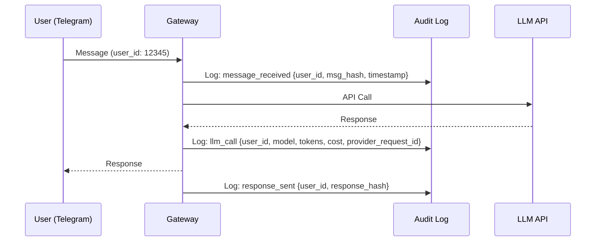
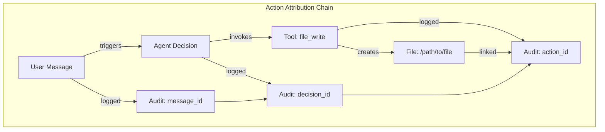
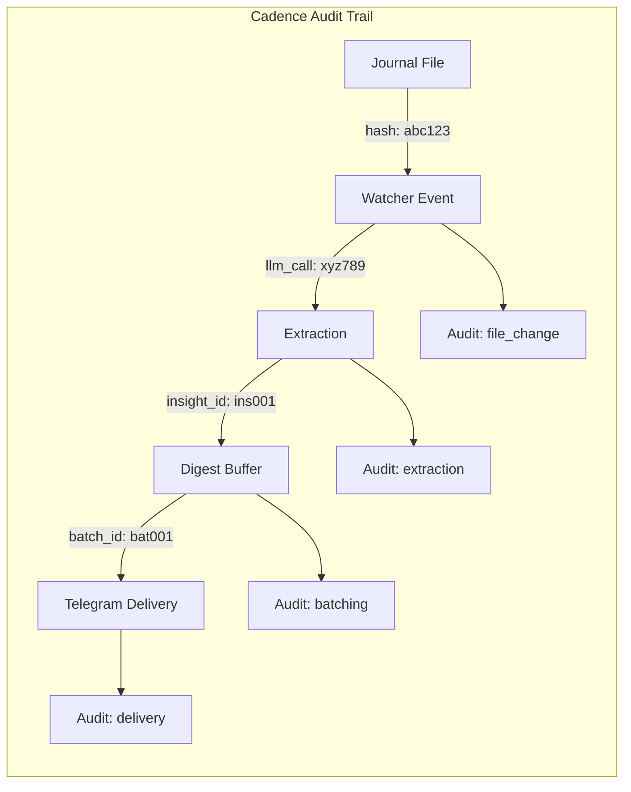
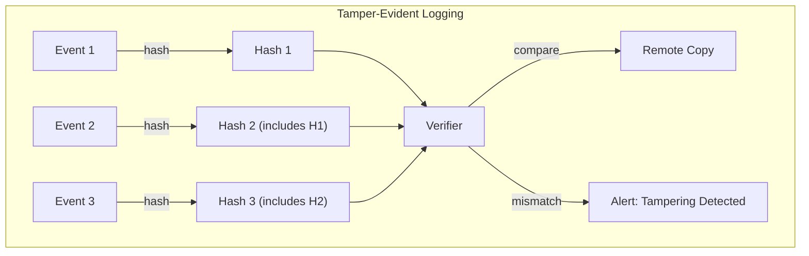
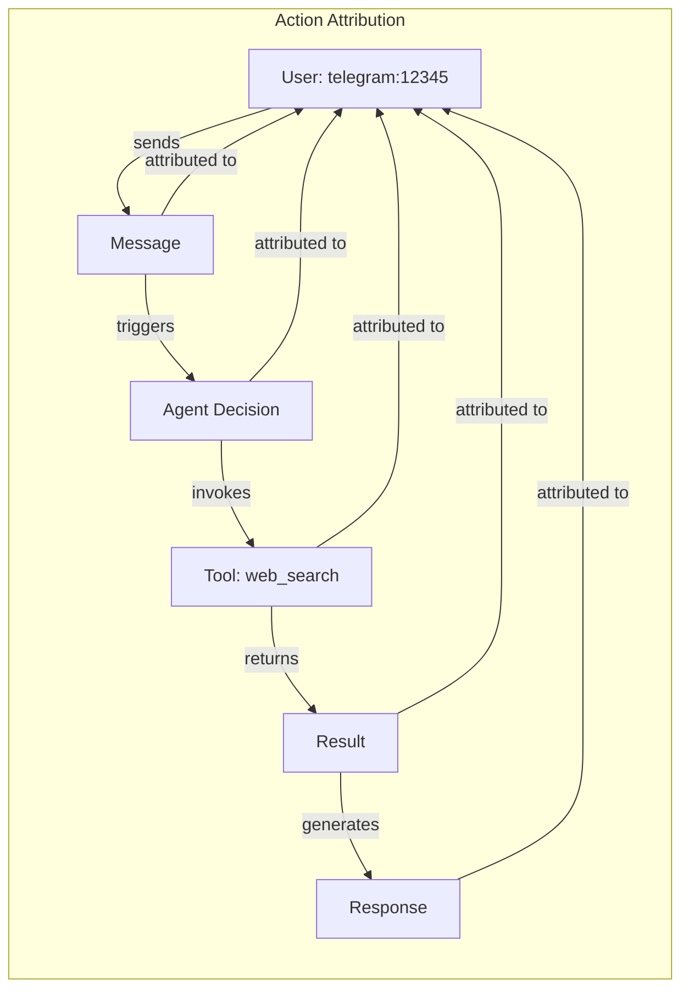
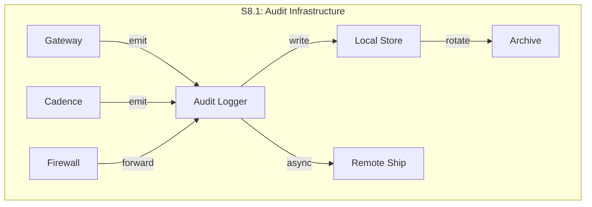
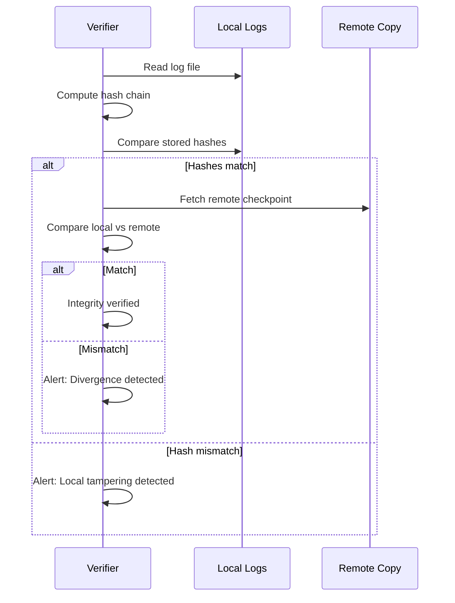
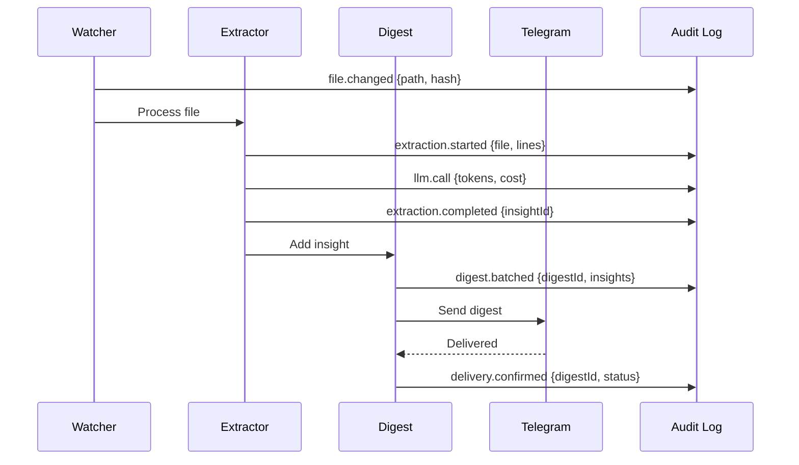

# STRIDE Analysis: Repudiation Threats in OpenClaw Sandbox

**Category**: R - Repudiation
**Phase**: S8 - Audit Logging (Planned)
**Status**: Security Plan
**Last Updated**: 2024

---

## Table of Contents

1. [Executive Summary](#executive-summary)
2. [Threat Inventory](#threat-inventory)
3. [Attack Scenarios](#attack-scenarios)
4. [Current Mitigations](#current-mitigations)
5. [Gaps Analysis](#gaps-analysis)
6. [Remediation Plan](#remediation-plan)
7. [Verification Tests](#verification-tests)
8. [Article Outline](#article-outline)

---

## Executive Summary

### Why Non-Repudiation Matters for AI Agents

AI agents operating autonomously present a unique accountability challenge: **actions taken on behalf of a user may be denied, disputed, or misattributed**. Unlike traditional software where users directly invoke commands, AI agents make decisions and take actions with varying degrees of autonomy. This creates several critical problems:

1. **Action Attribution**: When an agent sends a message, makes an API call, or accesses a resource, who is responsible? The user who triggered it? The agent configuration? The ambient pipeline that scheduled it?

2. **Cost Accountability**: LLM API calls cost money. Without proper audit trails, users can dispute charges, and operators cannot accurately allocate costs.

3. **Incident Forensics**: When something goes wrong (prompt injection, data exfiltration, abuse), reconstructing the sequence of events requires tamper-evident logs that cannot be modified after the fact.

4. **Compliance Requirements**: Many organizations require audit trails for any system that processes sensitive data or takes automated actions.

5. **Trust Verification**: In multi-user or multi-agent scenarios, non-repudiation enables verification that actions were actually authorized by the claimed principal.

**The OpenClaw Sandbox currently lacks comprehensive audit logging**, meaning users can deny triggering actions, log files can be modified, and there is no cryptographic proof of who did what and when.

### Risk Summary

| Risk Area | Current State | Impact |
|-----------|---------------|--------|
| Message authorship | No verification | High - Users can deny sending messages |
| Agent actions | Basic stdout logs | High - Actions not attributed to principals |
| Log integrity | Plain text files | Critical - Logs can be modified/deleted |
| LLM call tracking | None | Medium - Cannot track costs or quotas |
| Cadence attribution | None | Medium - Insights not linked to source |

---

## Threat Inventory

### T-R1: Denying Message Authorship (Telegram)

**Description**: A user sends a message via Telegram that triggers an inappropriate, expensive, or malicious agent response, then denies having sent it.

**Attack Surface**:
- Telegram `dmPolicy: "open"` allows anyone to message
- Telegram user IDs can be spoofed in logs (if logs are editable)
- No cryptographic binding between Telegram message and action

**Current State**:
```yaml
# fix-vm-paths.yml sets open access
telegram_dm_policy: "open"
allowFrom: ["*"]
```

**Evidence Required for Non-Repudiation**:
- Telegram message ID (immutable)
- Telegram user ID (verified by Telegram API)
- Timestamp from Telegram API (not local clock)
- Message content hash
- Resulting agent action chain

### T-R2: Denying Agent Actions

**Description**: An agent takes an action (file write, API call, external request) and the responsible party denies authorizing it.

**Attack Surface**:
- Gateway service runs all actions under single service account
- No per-action authorization tracking
- Ambient pipelines (Cadence) act without explicit user trigger

**Action Types Requiring Attribution**:
| Action Type | Trigger Source | Current Logging |
|-------------|----------------|-----------------|
| Chat response | User message | stdout only |
| Tool invocation | Agent decision | None |
| File operations | Agent/Cadence | None |
| External API call | Agent | None |
| Insight extraction | Cadence watcher | None |
| Digest delivery | Cadence scheduler | None |

### T-R3: Log Deletion/Modification

**Description**: Audit logs are modified or deleted to hide malicious activity or deny that events occurred.

**Attack Surface**:
```bash
# Current log location - easily modifiable
/tmp/openclaw/openclaw-$(date +%Y-%m-%d).log

# Anyone with shell access can:
rm /tmp/openclaw/*.log
echo "fake entry" >> /tmp/openclaw/openclaw-2024-01-01.log
```

**Modification Vectors**:
1. Direct file editing by compromised process
2. Log rotation scripts that delete old logs
3. VM snapshot restore to earlier state
4. Symbolic link attacks redirecting log writes

### T-R4: Missing Audit Trail for LLM Calls

**Description**: No record of which LLM calls were made, by whom, for what purpose, and at what cost.

**Impact**:
- Cannot allocate costs to users/projects
- Cannot detect abuse or quota violations
- Cannot replay or debug agent decisions
- Cannot prove compliance with usage policies

**LLM Call Metadata Required**:
```typescript
interface LLMCallAuditRecord {
  // Identity
  callId: string;           // Unique identifier
  triggeredBy: Principal;   // User, agent, or system
  agentId: string;          // Which agent made the call

  // Request
  provider: string;         // anthropic, openai, etc.
  model: string;            // claude-3-opus, gpt-4, etc.
  inputTokens: number;      // Token count
  promptHash: string;       // SHA-256 of prompt

  // Response
  outputTokens: number;     // Token count
  responseHash: string;     // SHA-256 of response
  latencyMs: number;        // Call duration

  // Cost
  estimatedCost: number;    // USD estimate

  // Provenance
  timestamp: string;        // ISO 8601
  requestId: string;        // Provider's request ID
}
```

### T-R5: Cadence Insight Attribution

**Description**: Insights extracted by Cadence cannot be traced back to their source documents or the context of extraction.

**Attribution Chain Required**:
```
Journal Entry → Insight Extraction → Digest Inclusion → Delivery
     │                │                    │              │
     └─ sourceFile    └─ llmCallId         └─ digestId    └─ deliveryId
        lineNumbers      extractionTime       batchTime       channel
        contentHash      insightHash          recipients      timestamp
```

**Current State**:
- Cadence processes files but doesn't log which files
- Insights are extracted but not linked to source
- Deliveries happen but aren't recorded
- No way to answer: "What journal entries contributed to this insight?"

---

## Attack Scenarios

### Scenario 1: The Costly Denial

**Setup**: Multi-user sandbox with shared API keys

**Attack**:
1. User A triggers expensive GPT-4 operations via Telegram
2. Monthly bill arrives showing $500 in API costs
3. User A denies sending the messages
4. No audit trail links messages to user or costs to actions

**Impact**: Financial dispute, no resolution mechanism

**Required Mitigation**:


### Scenario 2: The Phantom Action

**Setup**: Agent with tool access (file system, web)

**Attack**:
1. Agent decides to write sensitive data to a file
2. Security incident discovered later
3. Investigation finds the file but no record of who/what created it
4. Cannot determine if user authorized the action or agent went rogue

**Impact**: Security incident with no forensic trail

**Required Mitigation**:


### Scenario 3: The Vanishing Evidence

**Setup**: Compromised agent or insider threat

**Attack**:
1. Attacker uses agent to exfiltrate data
2. Attacker deletes/modifies logs to cover tracks
3. Later forensic analysis finds gaps in logs
4. Cannot prove what happened or who did it

**Impact**: Data breach with destroyed evidence

**Required Mitigation**: Tamper-evident logging with:
- Append-only log structure
- Cryptographic hash chaining
- External log shipping (can't delete remote copy)
- Periodic integrity verification

### Scenario 4: The Ambient Blame Game

**Setup**: Cadence pipeline running autonomously

**Attack**:
1. Cadence extracts sensitive insight from journal
2. Insight is delivered to Telegram group
3. Sensitive information exposed
4. User claims they never intended that content to be shared
5. No record of which file, which extraction, which rule triggered delivery

**Impact**: Privacy violation with unclear responsibility

**Required Mitigation**:


---

## Current Mitigations

### What Logging Exists Now

#### 1. Systemd Journal Logs

```bash
# Gateway service logs
journalctl -u openclaw-gateway

# Cadence service logs
journalctl -u openclaw-cadence
```

**Limitations**:
- No structured format
- No action attribution
- Logs stored locally (deletable)
- No integrity protection

#### 2. UFW Firewall Logs

```yaml
# ansible/roles/firewall/defaults/main.yml
firewall_enable_logging: true
firewall_log_limit: "3/min"
```

**What's Logged**:
- Denied network connections (outbound)
- Basic packet info (source, dest, port)

**Limitations**:
- Only denied traffic, not allowed
- No application-level context
- Rate-limited (can miss events)

#### 3. OpenClaw Gateway Logs

```bash
# Default log location
/tmp/openclaw/openclaw-$(date +%Y-%m-%d).log
```

**What's Logged**:
- Gateway startup/shutdown
- Telegram message events (basic)
- Error conditions

**Limitations**:
- Plain text, easily modified
- No structured format (grep-based analysis)
- No action chain linking
- No cost tracking
- Rotated/deleted on restart

#### 4. Secrets Handling (no_log)

```yaml
# ansible/roles/secrets/tasks/main.yml
no_log: true  # Used throughout
```

**What's Protected**:
- Secret values never in Ansible output
- No secrets in process lists

**What's Missing**:
- No audit of secret access
- No record of which service used which secret

### Current Logging Architecture

```mermaid
flowchart TD
    subgraph "Current State - No Unified Audit"
        G[Gateway] -->|stdout| J1[journalctl]
        G -->|file| L1[/tmp/openclaw/*.log]

        C[Cadence] -->|stdout| J2[journalctl]

        F[Firewall] -->|syslog| J3[journalctl]

        J1 --> D1[Deletable]
        J2 --> D1
        J3 --> D1
        L1 --> D2[Modifiable]
    end

    style D1 fill:#f66,stroke:#333
    style D2 fill:#f66,stroke:#333
```

---

## Gaps Analysis

### Gap 1: No Structured Audit Logging

**Current**: Unstructured text logs scattered across files and journald
**Required**: Centralized, structured audit events with defined schema

**Missing Capabilities**:
- [ ] Event schema definition
- [ ] Structured JSON/protobuf format
- [ ] Event categorization (auth, action, system)
- [ ] Correlation IDs across events
- [ ] Query/filter capabilities

**Proposed Schema**:
```typescript
interface AuditEvent {
  // Event identity
  id: string;              // UUID v7 (time-ordered)
  timestamp: string;       // ISO 8601 with timezone
  version: number;         // Schema version

  // Event classification
  category: 'auth' | 'action' | 'system' | 'security';
  type: string;            // Specific event type
  severity: 'info' | 'warn' | 'error' | 'critical';

  // Principal (who)
  principal: {
    type: 'user' | 'agent' | 'system' | 'service';
    id: string;            // User ID, agent ID, etc.
    source: string;        // telegram, api, scheduler, etc.
  };

  // Action (what)
  action: {
    name: string;          // Action identifier
    target: string;        // What was acted upon
    outcome: 'success' | 'failure' | 'partial';
  };

  // Context
  context: {
    sessionId?: string;
    conversationId?: string;
    parentEventId?: string;
    correlationId?: string;
  };

  // Details (action-specific)
  details: Record<string, unknown>;

  // Integrity
  previousHash?: string;   // Hash of previous event (chain)
  signature?: string;      // HMAC of event (tamper detection)
}
```

### Gap 2: No Tamper-Evident Logs

**Current**: Plain text files, easily modified or deleted
**Required**: Cryptographic integrity protection

**Missing Capabilities**:
- [ ] Hash chaining between events
- [ ] Digital signatures on log entries
- [ ] Append-only log structure
- [ ] External backup/shipping
- [ ] Periodic integrity verification
- [ ] Alerting on tampering detection

**Tamper-Evidence Architecture**:


### Gap 3: No Action Attribution

**Current**: Actions logged without principal binding
**Required**: Every action linked to triggering principal

**Missing Capabilities**:
- [ ] Principal identification on every action
- [ ] Authorization decision logging
- [ ] Action chain linking (message -> decision -> tool -> result)
- [ ] Delegation tracking (user authorized agent to act)
- [ ] Ambient action attribution (scheduler, watcher)

**Attribution Model**:


### Gap 4: No Cost Tracking per User

**Current**: No tracking of LLM API costs
**Required**: Per-user, per-action cost allocation

**Missing Capabilities**:
- [ ] Token counting per request
- [ ] Cost estimation per provider/model
- [ ] User quota management
- [ ] Cost attribution in audit events
- [ ] Usage reports per principal
- [ ] Anomaly detection (sudden cost spike)

**Cost Tracking Model**:
```typescript
interface CostTrackingRecord {
  userId: string;
  period: string;          // YYYY-MM-DD

  usage: {
    anthropic: {
      inputTokens: number;
      outputTokens: number;
      estimatedCost: number;
      callCount: number;
    };
    openai: { /* ... */ };
    // per provider
  };

  quota: {
    dailyLimit: number;    // USD
    monthlyLimit: number;
    currentDaily: number;
    currentMonthly: number;
  };
}
```

### Gap 5: Missing Cadence Insight Attribution

**Current**: Insights extracted without source linking
**Required**: Full provenance from journal to delivery

**Missing Capabilities**:
- [ ] Source file tracking (which file contributed)
- [ ] Content hash at extraction time
- [ ] LLM call linking (which extraction call)
- [ ] Insight-to-digest mapping
- [ ] Delivery confirmation logging
- [ ] User opt-in tracking (::publish tag)

**Cadence Audit Events Required**:
| Event Type | Trigger | Data |
|------------|---------|------|
| `cadence.file.changed` | File watcher | path, hash, mtime |
| `cadence.extraction.started` | Tag detected | file, lineNumbers, tag |
| `cadence.extraction.completed` | LLM returns | insightId, llmCallId, tokens |
| `cadence.digest.batched` | Threshold met | digestId, insightIds, count |
| `cadence.delivery.sent` | Digest ready | digestId, channel, recipient |
| `cadence.delivery.confirmed` | Ack received | digestId, deliveryStatus |

---

## Remediation Plan

### Phase S8: Audit Logging Implementation

#### S8.1: Audit Event Infrastructure

**Goal**: Create foundational audit logging system

**Deliverables**:
1. Audit event schema (TypeScript interfaces)
2. Audit logger service
3. Event serialization (JSON with optional protobuf)
4. Local storage with rotation
5. Basic query CLI

**Architecture**:


**Ansible Role**:
```yaml
# ansible/roles/audit/defaults/main.yml
audit_enabled: true
audit_log_dir: /var/log/openclaw/audit
audit_retention_days: 90
audit_format: json  # or protobuf
audit_remote_ship: false
audit_remote_endpoint: ""
audit_hash_chain: true
audit_sign_events: false  # requires key management
```

#### S8.2: Tamper-Evidence Implementation

**Goal**: Make logs cryptographically tamper-evident

**Deliverables**:
1. Hash chain implementation (SHA-256)
2. Append-only log file format
3. Integrity verification tool
4. Tampering detection alerts
5. Remote log shipping (optional)

**Hash Chain Format**:
```json
{
  "id": "01HQG7NJKPF3X...",
  "timestamp": "2024-01-15T10:30:00Z",
  "event": { /* ... */ },
  "previousHash": "abc123...",
  "eventHash": "def456..."
}
```

**Verification Process**:


#### S8.3: Gateway Action Attribution

**Goal**: Link every gateway action to a principal

**Deliverables**:
1. Request context with principal info
2. Action logging middleware
3. LLM call instrumentation
4. Response attribution
5. Tool invocation logging

**Integration Points**:
```typescript
// Gateway request handler
async function handleRequest(req: Request) {
  const context = {
    requestId: generateId(),
    principal: extractPrincipal(req),  // From auth header or Telegram user
    timestamp: new Date().toISOString(),
  };

  auditLog.emit({
    category: 'action',
    type: 'request.received',
    principal: context.principal,
    action: { name: 'chat', target: 'agent' },
    context: { requestId: context.requestId },
  });

  // ... process request with context passed through
}
```

#### S8.4: LLM Cost Tracking

**Goal**: Track and attribute LLM API costs

**Deliverables**:
1. Token counting integration
2. Cost estimation per provider
3. Per-user cost aggregation
4. Quota enforcement
5. Usage reports

**Cost Tracking Events**:
```typescript
auditLog.emit({
  category: 'action',
  type: 'llm.call',
  principal: context.principal,
  action: {
    name: 'llm_completion',
    target: `${provider}/${model}`,
    outcome: 'success',
  },
  details: {
    provider: 'anthropic',
    model: 'claude-3-5-sonnet-20241022',
    inputTokens: 1250,
    outputTokens: 847,
    estimatedCost: 0.0089,
    latencyMs: 2340,
    providerRequestId: 'req_abc123',
  },
});
```

#### S8.5: Cadence Audit Integration

**Goal**: Full provenance tracking for ambient pipeline

**Deliverables**:
1. File watcher event logging
2. Extraction audit trail
3. Digest composition logging
4. Delivery confirmation tracking
5. Source-to-insight query tool

**Cadence Audit Flow**:


### Implementation Timeline

| Phase | Duration | Dependencies | Deliverables |
|-------|----------|--------------|--------------|
| S8.1 | 2 weeks | None | Audit infrastructure |
| S8.2 | 1 week | S8.1 | Tamper-evidence |
| S8.3 | 2 weeks | S8.1 | Gateway attribution |
| S8.4 | 1 week | S8.3 | Cost tracking |
| S8.5 | 2 weeks | S8.1, S8.4 | Cadence integration |

**Total**: 8 weeks

---

## Verification Tests

### Test Category 1: Audit Event Generation

```bash
# Test: Verify audit events are generated for all action types
./tests/audit/test-event-generation.sh

# Checks:
# [ ] Message received generates event
# [ ] LLM call generates event with token counts
# [ ] Tool invocation generates event
# [ ] Response sent generates event
# [ ] Cadence file change generates event
# [ ] Cadence extraction generates event
# [ ] Cadence delivery generates event
```

### Test Category 2: Principal Attribution

```bash
# Test: Verify all events have correct principal
./tests/audit/test-attribution.sh

# Checks:
# [ ] Telegram message has user ID as principal
# [ ] API call has authenticated user as principal
# [ ] Scheduled task has "system:scheduler" as principal
# [ ] Ambient watcher has "system:cadence" as principal
# [ ] Principal survives full action chain
```

### Test Category 3: Tamper Detection

```bash
# Test: Verify tampering is detected
./tests/audit/test-tamper-detection.sh

# Checks:
# [ ] Modifying event content breaks hash chain
# [ ] Deleting event breaks hash chain
# [ ] Inserting event breaks hash chain
# [ ] Reordering events breaks hash chain
# [ ] Verifier detects all tampering types
# [ ] Alert generated on tampering
```

### Test Category 4: Cost Tracking

```bash
# Test: Verify cost tracking accuracy
./tests/audit/test-cost-tracking.sh

# Checks:
# [ ] Token counts match provider response
# [ ] Cost estimates within 5% of actual
# [ ] User aggregation is accurate
# [ ] Daily/monthly totals are correct
# [ ] Quota enforcement triggers at limit
```

### Test Category 5: Cadence Provenance

```bash
# Test: Verify insight provenance chain
./tests/audit/test-cadence-provenance.sh

# Checks:
# [ ] Can trace insight back to source file
# [ ] Source file hash matches extraction time
# [ ] LLM call is linked to extraction
# [ ] Digest contains correct insight references
# [ ] Delivery links back to digest
# [ ] Full chain is queryable via CLI
```

### Test Category 6: Query and Reporting

```bash
# Test: Verify audit query capabilities
./tests/audit/test-query.sh

# Checks:
# [ ] Query by principal returns all their events
# [ ] Query by time range works correctly
# [ ] Query by action type filters properly
# [ ] Query by correlation ID links events
# [ ] Usage report generates correct totals
# [ ] Export to CSV/JSON works
```

### Test Category 7: Log Integrity Over Time

```bash
# Test: Verify logs survive restart and rotation
./tests/audit/test-integrity.sh

# Checks:
# [ ] Hash chain valid after service restart
# [ ] Log rotation preserves chain continuity
# [ ] Archived logs remain verifiable
# [ ] Remote copy matches local after ship
# [ ] 90-day old logs still verifiable
```

### Integration Test Suite

```bash
# Full E2E audit test
./tests/audit/run-all.sh

# Test flow:
# 1. Send Telegram message
# 2. Verify message event logged with user principal
# 3. Verify LLM call event with tokens/cost
# 4. Verify response event
# 5. Modify journal file
# 6. Verify Cadence events (change -> extract -> digest -> deliver)
# 7. Run integrity verifier
# 8. Attempt log tampering
# 9. Verify tampering detected
# 10. Generate usage report
# 11. Verify report accuracy
```

---

## Article Outline

### Title: "R is for Repudiation: Audit Trails for Autonomous Agents"

### Target Publication
- Medium / Dev.to / Personal blog
- ~3000 words
- Technical audience: developers building AI agent systems

### Outline

#### 1. Introduction: The Autonomous Accountability Problem (400 words)

- Hook: "Your AI agent just sent an embarrassing message to your boss. You swear you didn't ask it to. How do you prove it?"
- The unique challenge of autonomous agents vs traditional software
- Why existing logging isn't enough
- Preview of the STRIDE "R" framework for agent systems

#### 2. What is Repudiation? (300 words)

- Definition in security context
- Classic examples (email spoofing, unsigned transactions)
- Why agents make this worse:
  - Agents make decisions independently
  - Multiple trigger sources (user, scheduler, ambient)
  - Actions have real-world consequences
  - Costs are incurred on behalf of users

#### 3. Threat Inventory: Five Ways Agents Enable Denial (600 words)

- **Message Authorship**: "I didn't send that"
- **Action Attribution**: "The agent did it, not me"
- **Log Tampering**: "That log entry was fabricated"
- **Cost Disputes**: "I didn't authorize those API calls"
- **Ambient Blame**: "I never meant that to be shared"

Code examples showing current vulnerable patterns.

#### 4. Attack Scenarios: Real-World Exploitation (400 words)

- Scenario 1: The Costly Denial (billing disputes)
- Scenario 2: The Phantom Action (security incidents)
- Scenario 3: The Vanishing Evidence (cover-ups)
- Scenario 4: The Ambient Blame Game (privacy violations)

Sequence diagrams showing attack flows.

#### 5. Designing Non-Repudiable Agent Systems (600 words)

- Principle 1: Structured Events (schema design)
- Principle 2: Tamper-Evidence (hash chains)
- Principle 3: Principal Attribution (every action has an owner)
- Principle 4: Cost Tracking (tokens = money = accountability)
- Principle 5: Provenance Chains (ambient action linking)

Architecture diagrams for each principle.

#### 6. Implementation: OpenClaw Sandbox Case Study (500 words)

- The S8 audit logging phase
- Key design decisions
- Integration points (Gateway, Cadence, Firewall)
- Verification approach

Code snippets from actual implementation.

#### 7. Beyond Logging: Organizational Practices (300 words)

- Log retention policies
- Incident response procedures
- Regular integrity verification
- User acknowledgment of agent actions
- Audit review processes

#### 8. Conclusion: Trust Through Transparency (200 words)

- Summary of key points
- The balance between autonomy and accountability
- Call to action: implement audit logging in your agent systems
- Link to OpenClaw Sandbox for reference implementation

### Supporting Materials

- GitHub repo with audit logging implementation
- Mermaid diagrams (embedded in article)
- Code snippets (TypeScript/Python examples)
- Checklist: "Is your agent system non-repudiable?"

### Promotion Plan

1. Post to Hacker News with title focus on "AI agent accountability"
2. Cross-post to r/MachineLearning and r/netsec
3. Tweet thread summarizing the 5 threats
4. LinkedIn article for enterprise audience

---

## Appendix A: Audit Event Schema (Full)

```typescript
// Full TypeScript schema for reference

export type AuditCategory = 'auth' | 'action' | 'system' | 'security';
export type AuditSeverity = 'debug' | 'info' | 'warn' | 'error' | 'critical';
export type ActionOutcome = 'success' | 'failure' | 'partial' | 'denied';

export interface Principal {
  type: 'user' | 'agent' | 'system' | 'service' | 'anonymous';
  id: string;
  source: 'telegram' | 'api' | 'scheduler' | 'watcher' | 'cli';
  metadata?: Record<string, string>;
}

export interface ActionInfo {
  name: string;
  target: string;
  outcome: ActionOutcome;
  durationMs?: number;
  errorCode?: string;
  errorMessage?: string;
}

export interface EventContext {
  sessionId?: string;
  conversationId?: string;
  requestId?: string;
  parentEventId?: string;
  correlationId?: string;
  spanId?: string;
}

export interface IntegrityInfo {
  previousHash: string;
  eventHash: string;
  signature?: string;
  signatureAlgorithm?: string;
}

export interface AuditEvent {
  // Identity
  id: string;  // UUID v7
  timestamp: string;  // ISO 8601
  schemaVersion: number;

  // Classification
  category: AuditCategory;
  type: string;
  severity: AuditSeverity;

  // Attribution
  principal: Principal;

  // Action
  action: ActionInfo;

  // Context
  context: EventContext;

  // Event-specific details
  details: Record<string, unknown>;

  // Integrity (added by logger)
  integrity?: IntegrityInfo;
}

// Specific event types

export interface MessageReceivedEvent extends AuditEvent {
  type: 'message.received';
  details: {
    channel: 'telegram' | 'api' | 'cli';
    messageId: string;
    contentHash: string;
    contentLength: number;
  };
}

export interface LLMCallEvent extends AuditEvent {
  type: 'llm.call';
  details: {
    provider: string;
    model: string;
    inputTokens: number;
    outputTokens: number;
    estimatedCost: number;
    latencyMs: number;
    promptHash: string;
    responseHash: string;
    providerRequestId: string;
  };
}

export interface ToolInvocationEvent extends AuditEvent {
  type: 'tool.invocation';
  details: {
    toolName: string;
    toolVersion?: string;
    inputHash: string;
    outputHash: string;
    durationMs: number;
  };
}

export interface CadenceExtractionEvent extends AuditEvent {
  type: 'cadence.extraction';
  details: {
    sourceFile: string;
    sourceHash: string;
    lineNumbers: number[];
    insightId: string;
    llmCallId: string;
  };
}

export interface CadenceDeliveryEvent extends AuditEvent {
  type: 'cadence.delivery';
  details: {
    digestId: string;
    channel: string;
    recipient: string;
    insightCount: number;
    deliveryStatus: 'sent' | 'delivered' | 'failed';
    messageId?: string;
  };
}
```

## Appendix B: Verification CLI Reference

```bash
# Audit log verification commands

# Verify integrity of local logs
claw audit verify --since 24h
# Output: Verified 1,247 events. Hash chain intact. No tampering detected.

# Verify against remote copy
claw audit verify --remote --endpoint https://audit.example.com
# Output: Local and remote match. 1,247 events verified.

# Query events by principal
claw audit query --principal telegram:12345 --since 7d
# Output: Found 89 events for principal telegram:12345

# Query by correlation ID (trace an action chain)
claw audit query --correlation-id abc123
# Output: 5 events in chain: message.received -> llm.call -> tool.invocation -> llm.call -> response.sent

# Generate usage report
claw audit report --user telegram:12345 --period 2024-01
# Output: Usage report for telegram:12345 (January 2024)
#   Total LLM calls: 234
#   Total tokens: 1,234,567 input / 456,789 output
#   Estimated cost: $12.34

# Export events
claw audit export --since 30d --format json --output audit-export.json
# Output: Exported 12,345 events to audit-export.json

# Detect anomalies
claw audit anomalies --since 24h
# Output:
#   WARN: User telegram:99999 - 50x normal API usage
#   WARN: 3 events with invalid hash chain at 2024-01-15T14:30:00Z
```

---

## References

1. STRIDE Threat Model - Microsoft Security Development Lifecycle
2. [OWASP Logging Cheat Sheet](https://cheatsheetseries.owasp.org/cheatsheets/Logging_Cheat_Sheet.html)
3. [Certificate Transparency](https://certificate.transparency.dev/) - Inspiration for tamper-evident logs
4. [Merkle Trees for Audit Logs](https://www.usenix.org/conference/usenixsecurity14/technical-sessions/presentation/crosby)
5. OpenClaw Documentation - Gateway Architecture
6. Anthropic API - Token Counting and Billing
