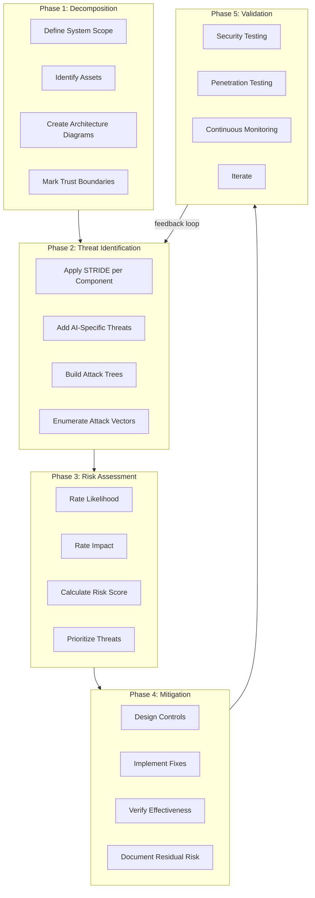
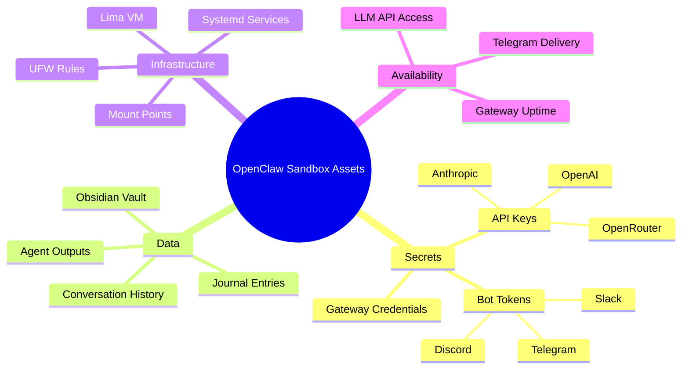
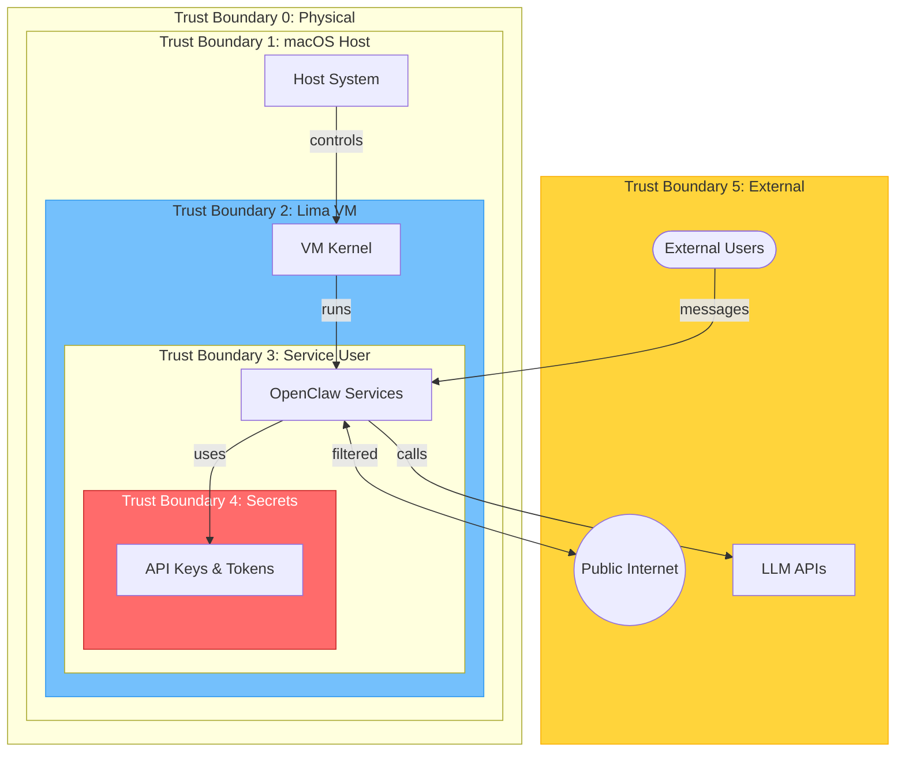
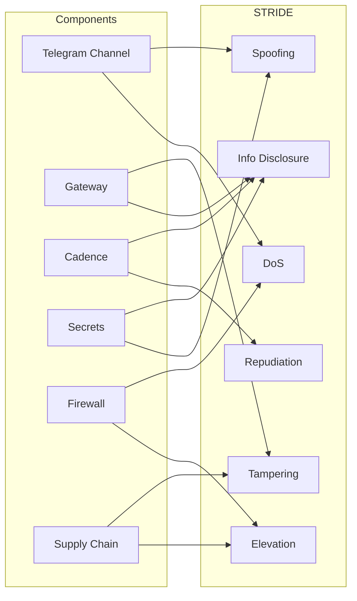
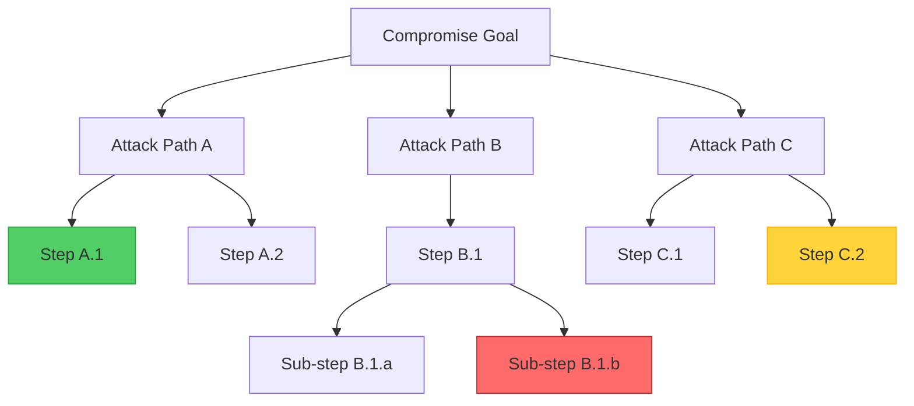
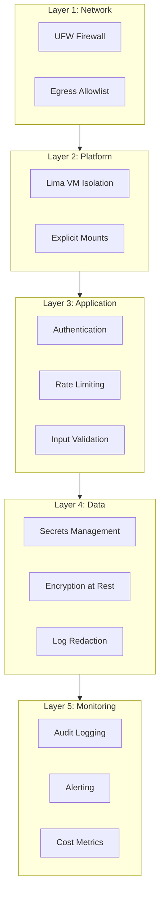
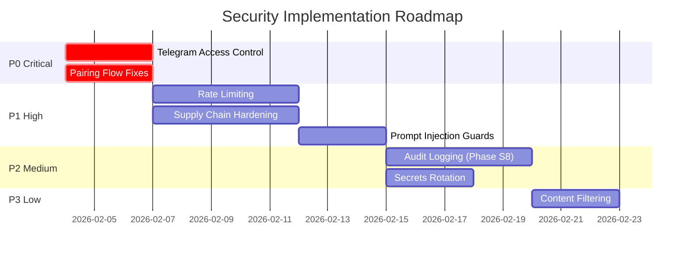
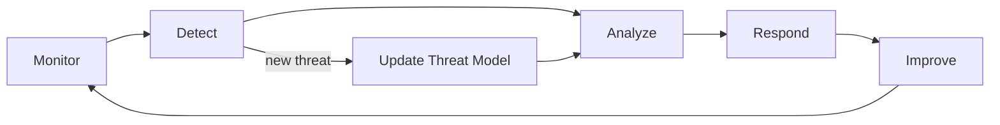

# Threat Modeling Methodology for AI Agent Systems

**Project**: OpenClaw Sandbox
**Version**: 1.0
**Status**: Living Document
**Last Updated**: 2026-02-03

---

## Executive Summary

This document establishes the threat modeling methodology for OpenClaw Sandbox—a secure, isolated VM environment for running AI agents. As AI agents become more autonomous and capable, the security considerations expand beyond traditional application security to include novel attack vectors like prompt injection, cost amplification, and agent capability escalation.

Our approach combines the industry-standard STRIDE framework with AI-specific threat categories to create a comprehensive security posture.

---

## Publication Series: "Threat Modeling with OpenClaw"

This methodology supports a technical article series designed to educate the security community on AI agent security:

| Article | STRIDE Component | Focus Area |
|---------|------------------|------------|
| **Introduction** | Overview | Why AI agents need threat modeling |
| **S is for Spoofing** | Spoofing | Identity in AI Agent Systems |
| **T is for Tampering** | Tampering | Data Integrity in LLM Pipelines |
| **R is for Repudiation** | Repudiation | Audit Trails for Autonomous Agents |
| **I is for Information Disclosure** | Info Disclosure | Secrets Management for AI Agents |
| **D is for Denial of Service** | DoS | Cost Control for LLM-Powered Systems |
| **E is for Elevation** | Elevation of Privilege | Containing Autonomous AI Agents |
| **Supply Chain** | Cross-cutting | Trust No One: Dependency Security |
| **Conclusion** | Synthesis | Defense in Depth for AI Systems |

---

## Methodology Overview



---

## Phase 1: System Decomposition

### 1.1 Scope Definition

**In Scope:**
- Lima VM and host interaction
- OpenClaw Gateway service
- Cadence ambient AI pipeline
- Telegram bot integration
- Secrets management
- Network containment (UFW)
- Tailscale routing
- Supply chain dependencies

**Out of Scope:**
- Upstream OpenClaw core security (separate analysis)
- macOS host security (assumed trusted)
- Physical security
- Social engineering attacks on operators

### 1.2 Asset Inventory



### 1.3 Architecture Diagram

```mermaid
flowchart TB
    subgraph Host["macOS Host (Trust Level: HIGH)"]
        User([Operator])
        Bootstrap[bootstrap.sh]
        HostSecrets[~/.openclaw-secrets.env]
        OpenClawRepo[OpenClaw Repo]
        Vault[Obsidian Vault]
        Tailscale[Tailscale Daemon]
    end

    subgraph VM["Ubuntu 24.04 VM (Trust Level: MEDIUM)"]
        subgraph Services["Services"]
            Gateway[Gateway :18789]
            Cadence[Cadence Service]
        end

        subgraph Security["Security Layer"]
            UFW[UFW Firewall]
            SecretsEnv[/etc/openclaw/secrets.env]
        end

        subgraph Mounts["Mount Points (Trust Level: HIGH)"]
            MntOC[/mnt/openclaw]
            MntSecrets[/mnt/secrets]
            MntVault[/mnt/obsidian]
        end
    end

    subgraph External["External Services (Trust Level: LOW)"]
        Anthropic[Anthropic API]
        TelegramAPI[Telegram API]
        TelegramUsers([Telegram Users])
        NPM[npm Registry]
    end

    User --> Bootstrap
    Bootstrap --> |provisions| VM
    HostSecrets --> |mount| MntSecrets
    OpenClawRepo --> |mount| MntOC
    Vault --> |mount| MntVault

    MntSecrets --> |parsed| SecretsEnv
    Gateway --> |HTTPS| Anthropic
    Gateway --> |HTTPS| TelegramAPI
    TelegramUsers --> |messages| Gateway
    Cadence --> |watches| MntVault
    Cadence --> |calls| Gateway

    UFW --> |filters| External
    Gateway --> |via host| Tailscale

    NPM --> |bun install| MntOC
```

### 1.4 Trust Boundaries



**Trust Levels:**

| Boundary | Level | Description |
|----------|-------|-------------|
| TB0: Physical | Implicit | Physical access = total compromise |
| TB1: macOS Host | HIGH | Operator-controlled, trusted |
| TB2: Lima VM | MEDIUM | Isolated but shares resources |
| TB3: Service User | MEDIUM | Non-root, limited privileges |
| TB4: Secrets | CRITICAL | Most sensitive assets |
| TB5: External | LOW | Untrusted by default |

---

## Phase 2: Threat Identification

### 2.1 STRIDE Framework

STRIDE is a threat classification model developed by Microsoft:

| Letter | Threat Type | Property Violated | Question to Ask |
|--------|-------------|-------------------|-----------------|
| **S** | Spoofing | Authentication | Can someone pretend to be another user/system? |
| **T** | Tampering | Integrity | Can data be modified in unauthorized ways? |
| **R** | Repudiation | Non-repudiation | Can actions be denied without proof? |
| **I** | Information Disclosure | Confidentiality | Can secrets or data leak? |
| **D** | Denial of Service | Availability | Can the system be made unavailable? |
| **E** | Elevation of Privilege | Authorization | Can someone gain unauthorized access? |

### 2.2 STRIDE Per Component



### 2.3 AI-Specific Threat Extensions

Traditional STRIDE doesn't capture all AI agent risks. We extend with:

| Threat Category | Description | STRIDE Mapping |
|-----------------|-------------|----------------|
| **Prompt Injection** | Malicious input manipulates agent behavior | Tampering + Elevation |
| **Cost Amplification** | Attacks that exhaust API credits | DoS (financial) |
| **Context Leakage** | Training data or context extracted | Information Disclosure |
| **Capability Escalation** | Agent gains access to new tools | Elevation of Privilege |
| **Output Weaponization** | Agent produces harmful outputs | Tampering + Repudiation |
| **Model Poisoning** | Upstream model contains backdoors | Supply Chain + Tampering |

### 2.4 Attack Tree Template



Legend:
- 🟢 Green: Mitigated
- 🔴 Red: Vulnerable
- 🟡 Yellow: Partially Mitigated

---

## Phase 3: Risk Assessment

### 3.1 Risk Scoring Matrix

```
Risk Score = Likelihood × Impact
```

**Likelihood Scale:**

| Score | Level | Description |
|-------|-------|-------------|
| 1 | Rare | Requires significant expertise and access |
| 2 | Unlikely | Requires specific conditions |
| 3 | Possible | Could occur with moderate effort |
| 4 | Likely | Expected to occur regularly |
| 5 | Almost Certain | Trivial to exploit |

**Impact Scale:**

| Score | Level | Description |
|-------|-------|-------------|
| 1 | Negligible | Minor inconvenience |
| 2 | Minor | Limited data exposure or brief outage |
| 3 | Moderate | Significant data exposure or extended outage |
| 4 | Major | Critical data breach or service compromise |
| 5 | Catastrophic | Complete system compromise, massive data breach |

**Risk Matrix:**

```
           IMPACT
         1  2  3  4  5
       ┌──┬──┬──┬──┬──┐
     5 │ 5│10│15│20│25│ ← Almost Certain
L    4 │ 4│ 8│12│16│20│ ← Likely
I    3 │ 3│ 6│ 9│12│15│ ← Possible
K    2 │ 2│ 4│ 6│ 8│10│ ← Unlikely
E    1 │ 1│ 2│ 3│ 4│ 5│ ← Rare
       └──┴──┴──┴──┴──┘
         N  Mi Mo Ma Ca

Risk Levels:
  1-4:   LOW (Accept)
  5-9:   MEDIUM (Monitor)
  10-15: HIGH (Mitigate)
  16-25: CRITICAL (Immediate Action)
```

### 3.2 OpenClaw Sandbox Risk Register

| ID | Threat | STRIDE | Likelihood | Impact | Risk | Status |
|----|--------|--------|------------|--------|------|--------|
| T-001 | Telegram open access | S/D | 5 | 4 | **20** | Plan Ready |
| T-002 | API credit exhaustion | D | 4 | 3 | **12** | Gap |
| T-003 | Secrets in logs | I | 2 | 5 | **10** | Mitigated |
| T-004 | Supply chain compromise | T/E | 3 | 5 | **15** | Gap |
| T-005 | Prompt injection | T/E | 4 | 3 | **12** | Gap |
| T-006 | VM escape | E | 1 | 5 | **5** | Mitigated |
| T-007 | Journal content leak | I | 3 | 3 | **9** | Partial |
| T-008 | Missing audit trail | R | 4 | 2 | **8** | Gap |
| T-009 | Pairing flow bypass | S | 4 | 4 | **16** | Plan Ready |
| T-010 | Bot token theft | S/I | 2 | 4 | **8** | Partial |

---

## Phase 4: Mitigation Strategy

### 4.1 Defense in Depth



### 4.2 Mitigation Patterns

| Pattern | Description | Applicable Threats |
|---------|-------------|-------------------|
| **Zero Trust** | Verify every request, assume breach | S, E |
| **Least Privilege** | Minimal permissions required | E |
| **Defense in Depth** | Multiple layers of controls | All |
| **Fail Secure** | Default to deny on errors | S, E, D |
| **Input Validation** | Sanitize all external input | T |
| **Output Encoding** | Prevent injection in outputs | T, I |
| **Audit Everything** | Log all security-relevant events | R |
| **Rate Limiting** | Prevent resource exhaustion | D |
| **Secrets Rotation** | Limit exposure window | I |

### 4.3 Implementation Priority



---

## Phase 5: Validation

### 5.1 Security Testing Approach

| Test Type | Purpose | Frequency |
|-----------|---------|-----------|
| **Unit Tests** | Verify individual security controls | Every PR |
| **Integration Tests** | Test control interactions | Every PR |
| **E2E Security Tests** | Full attack scenario testing | Weekly |
| **Penetration Testing** | Adversarial testing | Quarterly |
| **Dependency Scanning** | Supply chain vulnerabilities | Daily (CI) |
| **Secret Scanning** | Detect leaked secrets | Every commit |

### 5.2 Continuous Improvement



---

## Appendix A: Threat Model Document Index

| Document | STRIDE | Status |
|----------|--------|--------|
| [Spoofing](stride/spoofing.md) | Spoofing | In Progress |
| [Tampering](stride/tampering.md) | Tampering | In Progress |
| [Repudiation](stride/repudiation.md) | Repudiation | In Progress |
| [Information Disclosure](stride/information-disclosure.md) | Information Disclosure | In Progress |
| [Denial of Service](stride/denial-of-service.md) | Denial of Service | In Progress |
| [Elevation of Privilege](stride/elevation-of-privilege.md) | Elevation of Privilege | In Progress |
| [Supply Chain](stride/supply-chain.md) | Cross-cutting | In Progress |

---

## Appendix B: Glossary

| Term | Definition |
|------|------------|
| **Agent** | Autonomous AI system that takes actions |
| **Attack Surface** | Sum of all attack vectors |
| **Attack Tree** | Hierarchical diagram of attack paths |
| **Blast Radius** | Scope of damage from successful attack |
| **Cost Amplification** | Attack that exhausts paid resources |
| **DFD** | Data Flow Diagram |
| **Prompt Injection** | Manipulating LLM via malicious input |
| **STRIDE** | Spoofing, Tampering, Repudiation, Info Disclosure, DoS, Elevation |
| **Trust Boundary** | Interface between different trust levels |

---

## Appendix C: References

1. Microsoft STRIDE Threat Modeling - https://docs.microsoft.com/en-us/azure/security/develop/threat-modeling-tool-threats
2. OWASP Threat Modeling - https://owasp.org/www-community/Threat_Modeling
3. OWASP LLM Top 10 - https://owasp.org/www-project-top-10-for-large-language-model-applications/
4. NIST Cybersecurity Framework - https://www.nist.gov/cyberframework
5. Lima VM Security - https://lima-vm.io/docs/security/

---

## Document History

| Version | Date | Author | Changes |
|---------|------|--------|---------|
| 1.0 | 2026-02-03 | OpenClaw Team | Initial methodology |

